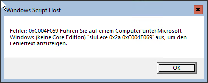
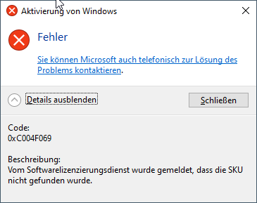
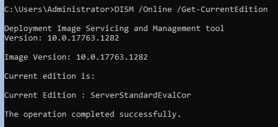
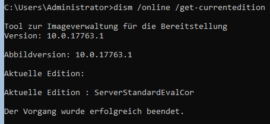
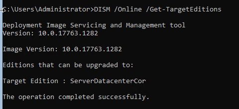
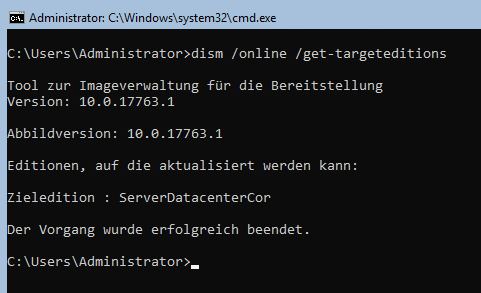
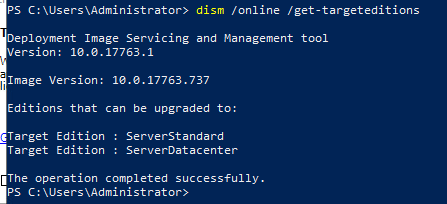
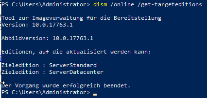
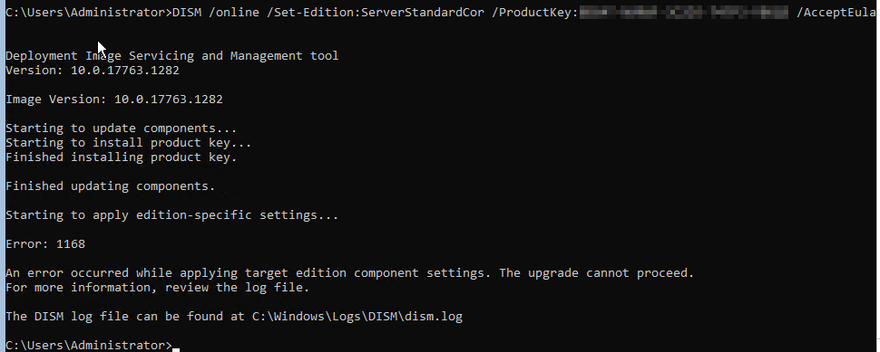

# Windows Server Core 2019 Standard Lizenzierungsprobleme

## Verwendete Images zur Installation

- 17763.737.190906-2324.rs5_release_svc_refresh_SERVER_EVAL_x64FRE_en-us.iso von
  <https://www.microsoft.com/en-us/evalcenter/evaluate-windows-server-2019?filetype=ISO>
- <http://software-cdn.eu/download/SW10214/WindowsServer_2019_DE.php> -> <http://software-cdn.eu/Files/WindowsServer_2019_DE.zip>

## Lizenzierung mit slmgr

Product Key Eingabe mit `slmgr /ipk` führte zu diesem Fehler:





Als nächstes habe ich nach Lösungsvorschlägen in Microsoft Foren gesucht und
bin u.a. auf [diesen Thread](https://social.technet.microsoft.com/Forums/en-US/ce0df7f5-91e6-47b2-b961-0634a7bdc010/activate-windows-server-1709-error?forum=ws2016)
gestossen.

Ausführen von `slmgr /upk`, um den bestehenden Product Key zu löschen. Die
Ergebnisse von `slmgr /ipk` blieben die gleichen.

Diese Schritte habe ich mit beiden Images durchgeführt und habe die genau
gleichen Ergebnisse erhalten.

### Schlussfolgerung

Es handelt sich bei dem gelieferten Schlüssel nicht um einen Retail Key und
darum funktioniert die Lizenzierung mit `slmgr /ipk` nicht!

## Konvertierung des Images mit dism

### Abfrage der aktuellen Edition

Abfrage der aktuellen Edition mit `dism /Online /Get-CurrentEdition` führte zu
folgenden Ergebnissen:




Beide Images zeigen hier das selbe Resultat.

### Abfrage der Ziel Editionen

Abfrage der Ziel Editionen mit `dism /Online /Get-TargetEditions führte zu
folgenden Ergebnissen:




Hier fällt auf, dass die Edition `ServerStandardCor` nicht zur Verfügung
steht. Darum habe ich diesen Versucht wiederholt mit der Installation der
Desktop Experience.




Hier sieht man nun die jeweilige Core Edition bei beiden Images. Also kann
davon ausgegangen werden, dass das installierte Online Image fehlerhaft ist.
Gemäss Aussagen in verschiedenen Foren war das bereits bei Server 2016 der Fall
und Microsoft hat diesen Fehler bis heute nicht behoben!

### Konvertierung des Images

`dism /Online /Set-Edition:ServerStandardCor /ProductKey:XXXXX-XXXXX-XXXXX-XXXXX-XXXXX /AcceptEula`

Auf den ersten Blick schaute das erfolgsversprechend aus, doch leider fehlen
einige Dateien, wodurch der Vorgang nicht abgeschlossen werden kann:



Und hier noch die Log Datei von DISM, den Product Key habe ich zensiert:

```text
2020-07-03 21:08:57, Info                  DISM   PID=3836 TID=2212 Scratch directory set to 'C:\Users\ADMINI~1\AppData\Local\Temp\3\'. - CDISMManager::put_ScratchDir
2020-07-03 21:08:57, Info                  DISM   PID=3836 TID=2212 DismCore.dll version: 10.0.17763.1282 - CDISMManager::FinalConstruct
2020-07-03 21:08:57, Info                  DISM   Initialized Panther logging at C:\Windows\Logs\DISM\dism.log
2020-07-03 21:08:57, Info                  DISM   PID=3836 TID=2212 Successfully loaded the ImageSession at "C:\Windows\system32\Dism" - CDISMManager::LoadLocalImageSession
2020-07-03 21:08:57, Info                  DISM   Initialized Panther logging at C:\Windows\Logs\DISM\dism.log
2020-07-03 21:08:57, Info                  DISM   DISM Provider Store: PID=3836 TID=2212 Found and Initialized the DISM Logger. - CDISMProviderStore::Internal_InitializeLogger
2020-07-03 21:08:57, Info                  DISM   DISM Provider Store: PID=3836 TID=2212 Failed to get and initialize the PE Provider.  Continuing by assuming that it is not a WinPE image. - CDISMProviderStore::Final_OnConnect
2020-07-03 21:08:57, Info                  DISM   DISM Provider Store: PID=3836 TID=2212 Finished initializing the Provider Map. - CDISMProviderStore::Final_OnConnect
2020-07-03 21:08:57, Info                  DISM   Initialized Panther logging at C:\Windows\Logs\DISM\dism.log
2020-07-03 21:08:57, Info                  DISM   DISM Manager: PID=3836 TID=2212 Successfully created the local image session and provider store. - CDISMManager::CreateLocalImageSession
2020-07-03 21:08:57, Info                  DISM   DISM.EXE:
2020-07-03 21:08:57, Info                  DISM   DISM.EXE: <----- Starting Dism.exe session ----->
2020-07-03 21:08:57, Info                  DISM   DISM.EXE:
2020-07-03 21:08:57, Info                  DISM   DISM.EXE: Host machine information: OS Version=10.0.17763, Running architecture=amd64, Number of processors=1
2020-07-03 21:08:57, Info                  DISM   DISM.EXE: Dism.exe version: 10.0.17763.1282
2020-07-03 21:08:57, Info                  DISM   DISM.EXE: Executing command line: DISM  /online /Set-Edition:ServerStandardCor /ProductKey:XXXXX-XXXXX-XXXXX-XXXXX-XXXXX /AcceptEula
2020-07-03 21:08:57, Info                  DISM   DISM Provider Store: PID=3836 TID=2212 Connecting to the provider located at C:\Windows\system32\Dism\FolderProvider.dll. - CDISMProviderStore::Internal_LoadProvider
2020-07-03 21:08:57, Info                  DISM   DISM Manager: PID=3836 TID=2212 physical location path: C:\ - CDISMManager::CreateImageSession
2020-07-03 21:08:57, Info                  DISM   DISM Manager: PID=3836 TID=2212 Event name for current DISM session is Global\{44C8263B-5ABB-416E-8036-AC4CA41B557B} - CDISMManager::CheckSessionAndLock
2020-07-03 21:08:57, Info                  DISM   DISM Manager: PID=3836 TID=2212 Create session event 0x210 for current DISM session and event name is Global\{44C8263B-5ABB-416E-8036-AC4CA41B557B}  - CDISMManager::CheckSessionAndLock
2020-07-03 21:08:57, Info                  DISM   DISM Manager: PID=3836 TID=2212 Copying DISM from "C:\Windows\System32\Dism" - CDISMManager::CreateImageSessionFromLocation
2020-07-03 21:08:57, Info                  DISM   DISM Manager: PID=3836 TID=2212 Successfully loaded the ImageSession at "C:\Users\ADMINI~1\AppData\Local\Temp\3\B12ED2DE-89B8-42AE-9415-4447A5B52DEE" - CDISMManager::LoadRemoteImageSession
2020-07-03 21:08:57, Info                  DISM   DISM Image Session: PID=2200 TID=3768 Instantiating the Provider Store. - CDISMImageSession::get_ProviderStore
2020-07-03 21:08:57, Info                  DISM   DISM Provider Store: PID=2200 TID=3768 Initializing a provider store for the IMAGE session type. - CDISMProviderStore::Final_OnConnect
2020-07-03 21:08:57, Info                  DISM   DISM Provider Store: PID=2200 TID=3768 Connecting to the provider located at C:\Users\ADMINI~1\AppData\Local\Temp\3\B12ED2DE-89B8-42AE-9415-4447A5B52DEE\OSProvider.dll. - CDISMProviderStore::Internal_LoadProvider
2020-07-03 21:08:57, Info                  DISM   DISM OS Provider: PID=2200 TID=3768 Defaulting SystemPath to C:\ - CDISMOSServiceManager::Final_OnConnect
2020-07-03 21:08:57, Info                  DISM   DISM OS Provider: PID=2200 TID=3768 Defaulting Windows folder to C:\Windows - CDISMOSServiceManager::Final_OnConnect
2020-07-03 21:08:57, Info                  DISM   DISM Provider Store: PID=2200 TID=3768 Attempting to initialize the logger from the Image Session. - CDISMProviderStore::Final_OnConnect
2020-07-03 21:08:57, Info                  DISM   DISM Provider Store: PID=2200 TID=3768 Connecting to the provider located at C:\Users\ADMINI~1\AppData\Local\Temp\3\B12ED2DE-89B8-42AE-9415-4447A5B52DEE\LogProvider.dll. - CDISMProviderStore::Internal_LoadProvider
2020-07-03 21:08:57, Info                  DISM   Initialized Panther logging at C:\Windows\Logs\DISM\dism.log
2020-07-03 21:08:57, Info                  DISM   DISM Provider Store: PID=2200 TID=3768 Found and Initialized the DISM Logger. - CDISMProviderStore::Internal_InitializeLogger
2020-07-03 21:08:57, Warning               DISM   DISM Provider Store: PID=2200 TID=3768 Failed to load the provider: C:\Users\ADMINI~1\AppData\Local\Temp\3\B12ED2DE-89B8-42AE-9415-4447A5B52DEE\PEProvider.dll. - CDISMProviderStore::Internal_GetProvider(hr:0x8007007e)
2020-07-03 21:08:57, Info                  DISM   DISM Provider Store: PID=2200 TID=3768 Failed to get and initialize the PE Provider.  Continuing by assuming that it is not a WinPE image. - CDISMProviderStore::Final_OnConnect
2020-07-03 21:08:57, Info                  DISM   DISM Provider Store: PID=2200 TID=3768 Finished initializing the Provider Map. - CDISMProviderStore::Final_OnConnect
2020-07-03 21:08:57, Info                  DISM   Initialized Panther logging at C:\Windows\Logs\DISM\dism.log
2020-07-03 21:08:57, Info                  DISM   Initialized Panther logging at C:\Windows\Logs\DISM\dism.log
2020-07-03 21:08:57, Info                  DISM   DISM Manager: PID=3836 TID=2212 Image session successfully loaded from the temporary location: C:\Users\ADMINI~1\AppData\Local\Temp\3\B12ED2DE-89B8-42AE-9415-4447A5B52DEE - CDISMManager::CreateImageSession
2020-07-03 21:08:57, Info                  DISM   DISM.EXE: Target image information: OS Version=10.0.17763.1282, Image architecture=amd64
2020-07-03 21:08:57, Info                  DISM   DISM.EXE: Image session version: 10.0.17763.771
2020-07-03 21:08:57, Info                  DISM   DISM Provider Store: PID=2200 TID=3312 Getting the collection of providers from an image provider store type. - CDISMProviderStore::GetProviderCollection
2020-07-03 21:08:57, Info                  DISM   DISM Provider Store: PID=2200 TID=3312 Connecting to the provider located at C:\Users\ADMINI~1\AppData\Local\Temp\3\B12ED2DE-89B8-42AE-9415-4447A5B52DEE\CbsProvider.dll. - CDISMProviderStore::Internal_LoadProvider
2020-07-03 21:08:57, Info                  DISM   DISM Provider Store: PID=2200 TID=3312 Encountered a servicing provider, performing additional servicing initializations. - CDISMProviderStore::Internal_LoadProvider
2020-07-03 21:08:57, Info                  CSI    00000001 Shim considered [l:126]'\??\C:\Windows\Servicing\amd64_microsoft-windows-servicingstack_31bf3856ad364e35_10.0.17763.1270_none_56fe36c7990bef7b\wcp.dll' : got STATUS_OBJECT_PATH_NOT_FOUND
2020-07-03 21:08:57, Info                  CSI    00000002 Shim considered [l:123]'\??\C:\Windows\WinSxS\amd64_microsoft-windows-servicingstack_31bf3856ad364e35_10.0.17763.1270_none_56fe36c7990bef7b\wcp.dll' : got STATUS_SUCCESS
2020-07-03 21:08:57, Info                  DISM   DISM Package Manager: PID=2200 TID=3312 Finished initializing the CbsConUI Handler. - CCbsConUIHandler::Initialize
2020-07-03 21:08:57, Info                  CSI    00000001 Shim considered [l:126]'\??\C:\Windows\Servicing\amd64_microsoft-windows-servicingstack_31bf3856ad364e35_10.0.17763.1270_none_56fe36c7990bef7b\wcp.dll' : got STATUS_OBJECT_PATH_NOT_FOUND
2020-07-03 21:08:57, Info                  CSI    00000002 Shim considered [l:123]'\??\C:\Windows\WinSxS\amd64_microsoft-windows-servicingstack_31bf3856ad364e35_10.0.17763.1270_none_56fe36c7990bef7b\wcp.dll' : got STATUS_SUCCESS
2020-07-03 21:08:57, Info                  DISM   DISM Package Manager: PID=2200 TID=3312 CBS is being initialized for online use. More information about CBS actions can be located at: %windir%\logs\cbs\cbs.log - CDISMPackageManager::Initialize
2020-07-03 21:08:57, Info                  DISM   DISM Package Manager: PID=2200 TID=3312 Loaded servicing stack for online use only. - CDISMPackageManager::CreateCbsSession
2020-07-03 21:08:57, Info                  DISM   DISM Provider Store: PID=2200 TID=3312 Connecting to the provider located at C:\Users\ADMINI~1\AppData\Local\Temp\3\B12ED2DE-89B8-42AE-9415-4447A5B52DEE\MsiProvider.dll. - CDISMProviderStore::Internal_LoadProvider
2020-07-03 21:08:57, Info                  DISM   DISM Provider Store: PID=2200 TID=3312 Encountered a servicing provider, performing additional servicing initializations. - CDISMProviderStore::Internal_LoadProvider
2020-07-03 21:08:57, Info                  DISM   DISM Provider Store: PID=2200 TID=3312 Connecting to the provider located at C:\Users\ADMINI~1\AppData\Local\Temp\3\B12ED2DE-89B8-42AE-9415-4447A5B52DEE\IntlProvider.dll. - CDISMProviderStore::Internal_LoadProvider
2020-07-03 21:08:57, Info                  DISM   DISM Provider Store: PID=2200 TID=3312 Encountered a servicing provider, performing additional servicing initializations. - CDISMProviderStore::Internal_LoadProvider
2020-07-03 21:08:57, Warning               DISM   DISM Provider Store: PID=2200 TID=3312 Failed to load the provider: C:\Users\ADMINI~1\AppData\Local\Temp\3\B12ED2DE-89B8-42AE-9415-4447A5B52DEE\IBSProvider.dll. - CDISMProviderStore::Internal_GetProvider(hr:0x8007007e)
2020-07-03 21:08:57, Info                  DISM   DISM Provider Store: PID=2200 TID=3312 Connecting to the provider located at C:\Users\ADMINI~1\AppData\Local\Temp\3\B12ED2DE-89B8-42AE-9415-4447A5B52DEE\DmiProvider.dll. - CDISMProviderStore::Internal_LoadProvider
2020-07-03 21:08:57, Info                  DISM   DISM Provider Store: PID=2200 TID=3312 Encountered a servicing provider, performing additional servicing initializations. - CDISMProviderStore::Internal_LoadProvider
2020-07-03 21:08:57, Info                  CSI    00000001 Shim considered [l:126]'\??\C:\Windows\Servicing\amd64_microsoft-windows-servicingstack_31bf3856ad364e35_10.0.17763.1270_none_56fe36c7990bef7b\wcp.dll' : got STATUS_OBJECT_PATH_NOT_FOUND
2020-07-03 21:08:57, Info                  CSI    00000002 Shim considered [l:123]'\??\C:\Windows\WinSxS\amd64_microsoft-windows-servicingstack_31bf3856ad364e35_10.0.17763.1270_none_56fe36c7990bef7b\wcp.dll' : got STATUS_SUCCESS
2020-07-03 21:08:57, Info                  DISM   DISM Driver Manager: PID=2200 TID=3312 Further logs for driver related operations can be found in the target operating system at %WINDIR%\inf\setupapi.offline.log - CDriverManager::Initialize
2020-07-03 21:08:57, Info                  DISM   DISM Provider Store: PID=2200 TID=3312 Connecting to the provider located at C:\Users\ADMINI~1\AppData\Local\Temp\3\B12ED2DE-89B8-42AE-9415-4447A5B52DEE\UnattendProvider.dll. - CDISMProviderStore::Internal_LoadProvider
2020-07-03 21:08:57, Info                  DISM   DISM Provider Store: PID=2200 TID=3312 Encountered a servicing provider, performing additional servicing initializations. - CDISMProviderStore::Internal_LoadProvider
2020-07-03 21:08:57, Info                  DISM   DISM Provider Store: PID=2200 TID=3312 Connecting to the provider located at C:\Users\ADMINI~1\AppData\Local\Temp\3\B12ED2DE-89B8-42AE-9415-4447A5B52DEE\SmiProvider.dll. - CDISMProviderStore::Internal_LoadProvider
2020-07-03 21:08:57, Info                  DISM   DISM Provider Store: PID=2200 TID=3312 Encountered a servicing provider, performing additional servicing initializations. - CDISMProviderStore::Internal_LoadProvider
2020-07-03 21:08:57, Warning               DISM   DISM Provider Store: PID=2200 TID=3312 Failed to load the provider: C:\Users\ADMINI~1\AppData\Local\Temp\3\B12ED2DE-89B8-42AE-9415-4447A5B52DEE\EmbeddedProvider.dll. - CDISMProviderStore::Internal_GetProvider(hr:0x8007007e)
2020-07-03 21:08:57, Warning               DISM   DISM Provider Store: PID=2200 TID=3312 Failed to load the provider: C:\Users\ADMINI~1\AppData\Local\Temp\3\B12ED2DE-89B8-42AE-9415-4447A5B52DEE\AppxProvider.dll. - CDISMProviderStore::Internal_GetProvider(hr:0x8007007e)
2020-07-03 21:08:57, Info                  DISM   DISM Provider Store: PID=2200 TID=3312 Connecting to the provider located at C:\Users\ADMINI~1\AppData\Local\Temp\3\B12ED2DE-89B8-42AE-9415-4447A5B52DEE\ProvProvider.dll. - CDISMProviderStore::Internal_LoadProvider
2020-07-03 21:08:57, Info                  DISM   DISM Provider Store: PID=2200 TID=3312 Encountered a servicing provider, performing additional servicing initializations. - CDISMProviderStore::Internal_LoadProvider
2020-07-03 21:08:57, Warning               DISM   DISM Provider Store: PID=2200 TID=3312 Failed to load the provider: C:\Users\ADMINI~1\AppData\Local\Temp\3\B12ED2DE-89B8-42AE-9415-4447A5B52DEE\AssocProvider.dll. - CDISMProviderStore::Internal_GetProvider(hr:0x8007007e)
2020-07-03 21:08:57, Info                  DISM   DISM Provider Store: PID=2200 TID=3312 Connecting to the provider located at C:\Users\ADMINI~1\AppData\Local\Temp\3\B12ED2DE-89B8-42AE-9415-4447A5B52DEE\GenericProvider.dll. - CDISMProviderStore::Internal_LoadProvider
2020-07-03 21:08:57, Info                  DISM   DISM Provider Store: PID=2200 TID=3312 Encountered a servicing provider, performing additional servicing initializations. - CDISMProviderStore::Internal_LoadProvider
2020-07-03 21:08:57, Info                  DISM   DISM Provider Store: PID=2200 TID=3312 Connecting to the provider located at C:\Users\ADMINI~1\AppData\Local\Temp\3\B12ED2DE-89B8-42AE-9415-4447A5B52DEE\OfflineSetupProvider.dll. - CDISMProviderStore::Internal_LoadProvider
2020-07-03 21:08:57, Info                  DISM   DISM Provider Store: PID=2200 TID=3312 Encountered a servicing provider, performing additional servicing initializations. - CDISMProviderStore::Internal_LoadProvider
2020-07-03 21:08:57, Info                  DISM   DISM Provider Store: PID=2200 TID=3312 Connecting to the provider located at C:\Users\ADMINI~1\AppData\Local\Temp\3\B12ED2DE-89B8-42AE-9415-4447A5B52DEE\SysprepProvider.dll. - CDISMProviderStore::Internal_LoadProvider
2020-07-03 21:08:57, Info                  DISM   DISM Provider Store: PID=2200 TID=3312 Encountered a servicing provider, performing additional servicing initializations. - CDISMProviderStore::Internal_LoadProvider
2020-07-03 21:08:57, Info                  DISM   DISM Provider Store: PID=2200 TID=3312 Connecting to the provider located at C:\Users\ADMINI~1\AppData\Local\Temp\3\B12ED2DE-89B8-42AE-9415-4447A5B52DEE\TransmogProvider.dll. - CDISMProviderStore::Internal_LoadProvider
2020-07-03 21:08:57, Info                  DISM   DISM Provider Store: PID=2200 TID=3312 Encountered a servicing provider, performing additional servicing initializations. - CDISMProviderStore::Internal_LoadProvider
2020-07-03 21:08:57, Info                  DISM   DISM Transmog Provider: PID=2200 TID=3312 Current image session is [ONLINE] - CTransmogManager::GetMode
2020-07-03 21:08:57, Info                  DISM   DISM Transmog Provider: PID=2200 TID=3312 Audit Mode: [No] - CTransmogManager::Initialize
2020-07-03 21:08:57, Info                  DISM   DISM Transmog Provider: PID=2200 TID=3312 GetProductType: ProductType = [ServerNT] - CTransmogManager::GetProductType
2020-07-03 21:08:57, Info                  DISM   DISM Transmog Provider: PID=2200 TID=3312 Product Type: [ServerNT] - CTransmogManager::Initialize
2020-07-03 21:08:57, Info                  DISM   DISM Transmog Provider: PID=2200 TID=3312 Product Type ServerNT : [Yes] - CTransmogManager::Initialize
2020-07-03 21:08:57, Info                  DISM   DISM Provider Store: PID=2200 TID=3312 Connecting to the provider located at C:\Users\ADMINI~1\AppData\Local\Temp\3\B12ED2DE-89B8-42AE-9415-4447A5B52DEE\SetupPlatformProvider.dll. - CDISMProviderStore::Internal_LoadProvider
2020-07-03 21:08:57, Info                  DISM   DISM Provider Store: PID=2200 TID=3312 Encountered a servicing provider, performing additional servicing initializations. - CDISMProviderStore::Internal_LoadProvider
2020-07-03 21:08:57, Info                  DISM   DISM.EXE: Got the collection of providers. Now enumerating them to build the command table.
2020-07-03 21:08:57, Info                  DISM   DISM.EXE: Attempting to add the commands from provider: DISM Log Provider
2020-07-03 21:08:57, Info                  DISM   DISM.EXE: Attempting to add the commands from provider: OSServices
2020-07-03 21:08:57, Info                  DISM   DISM.EXE: Attempting to add the commands from provider: DISM Package Manager
2020-07-03 21:08:57, Info                  DISM   DISM.EXE: Succesfully registered commands for the provider: DISM Package Manager.
2020-07-03 21:08:57, Info                  DISM   DISM.EXE: Attempting to add the commands from provider: MsiManager
2020-07-03 21:08:57, Info                  DISM   DISM.EXE: Succesfully registered commands for the provider: MsiManager.
2020-07-03 21:08:57, Info                  DISM   DISM.EXE: Attempting to add the commands from provider: IntlManager
2020-07-03 21:08:57, Info                  DISM   DISM.EXE: Succesfully registered commands for the provider: IntlManager.
2020-07-03 21:08:57, Info                  DISM   DISM.EXE: Attempting to add the commands from provider: DriverManager
2020-07-03 21:08:57, Info                  DISM   DISM.EXE: Succesfully registered commands for the provider: DriverManager.
2020-07-03 21:08:57, Info                  DISM   DISM.EXE: Attempting to add the commands from provider: DISM Unattend Manager
2020-07-03 21:08:57, Info                  DISM   DISM.EXE: Succesfully registered commands for the provider: DISM Unattend Manager.
2020-07-03 21:08:57, Info                  DISM   DISM.EXE: Attempting to add the commands from provider: SmiManager
2020-07-03 21:08:57, Info                  DISM   DISM.EXE: Attempting to add the commands from provider: ProvManager
2020-07-03 21:08:57, Info                  DISM   DISM.EXE: Succesfully registered commands for the provider: ProvManager.
2020-07-03 21:08:57, Info                  DISM   DISM.EXE: Attempting to add the commands from provider: GenericManager
2020-07-03 21:08:57, Info                  DISM   DISM.EXE: Succesfully registered commands for the provider: GenericManager.
2020-07-03 21:08:57, Info                  DISM   DISM.EXE: Attempting to add the commands from provider: OfflineSetupManager
2020-07-03 21:08:57, Info                  DISM   DISM.EXE: Succesfully registered commands for the provider: OfflineSetupManager.
2020-07-03 21:08:57, Info                  DISM   DISM.EXE: Attempting to add the commands from provider: SysprepManager
2020-07-03 21:08:57, Info                  DISM   DISM.EXE: Succesfully registered commands for the provider: SysprepManager.
2020-07-03 21:08:57, Info                  DISM   DISM.EXE: Attempting to add the commands from provider: Edition Manager
2020-07-03 21:08:57, Info                  DISM   DISM.EXE: Succesfully registered commands for the provider: Edition Manager.
2020-07-03 21:08:57, Info                  DISM   DISM.EXE: Attempting to add the commands from provider: SetupPlatformManager
2020-07-03 21:08:57, Info                  DISM   DISM.EXE: Succesfully registered commands for the provider: SetupPlatformManager.
2020-07-03 21:08:57, Info                  DISM   DISM Transmog Provider: PID=2200 TID=3828 Processed modifier argument: [productkey] - CTransmogManager::ExecuteCmdLine
2020-07-03 21:08:57, Info                  DISM   DISM Transmog Provider: PID=2200 TID=3828 Setting an edition online is supported on Server editions. - CTransmogManager::ExecuteCmdLine
2020-07-03 21:08:57, Info                  DISM   DISM Transmog Provider: PID=2200 TID=3828 Upgrading to EditionID [ServerStandardCor] - CTransmogManager::ExecuteCmdLine
2020-07-03 21:08:57, Info                  DISM   DISM Transmog Provider: PID=2200 TID=3828 Getting the composition edition for the edition id [ServerStandardEval] - CTransmogManager::GetCurrentEdition
2020-07-03 21:08:57, Info                  DISM   DISM Transmog Provider: PID=2200 TID=3828 Trying to open package for composition id [ServerStandardEval]... - CTransmogManager::GetCurrentEdition
2020-07-03 21:08:57, Info                  DISM   DISM Transmog Provider: PID=2200 TID=3828 Determined WinDir path = [C:\Windows] - CTransmogManager::GetWinDirPath
2020-07-03 21:08:57, Info                  DISM   DISM Transmog Provider: PID=2200 TID=3828 OpenPackageFromEditionId: Trying to open package: [Microsoft-Windows-ServerStandardEvalEdition~31bf3856ad364e35~amd64~~10.0.17763.1]... - CTransmogManager::OpenPackageFromEditionId
2020-07-03 21:08:57, Error                 DISM   DISM Package Manager: PID=2200 TID=3828 Failed opening package Microsoft-Windows-ServerStandardEvalEdition~31bf3856ad364e35~amd64~~10.0.17763.1. - CDISMPackageManager::Internal_CreatePackageByName(hr:0x800f0805)
2020-07-03 21:08:57, Error                 DISM   DISM Package Manager: PID=2200 TID=3828 Failed to get the underlying cbs package. - CDISMPackageManager::OpenPackageByName(hr:0x800f0805)
2020-07-03 21:08:57, Error                 DISM   DISM Package Manager: PID=2200 TID=3828 The specified package is not valid Windows package. - GetCbsErrorMsg
2020-07-03 21:08:57, Info                  DISM   DISM Transmog Provider: PID=2200 TID=3828 Building list of edition ids for edition [ServerStandardEval]... - CTransmogManager::OpenPackageFromEditionId
2020-07-03 21:08:57, Info                  DISM   DISM Transmog Provider: PID=2200 TID=3828 Retrieving list of package ids for edition [ServerStandardEval]... - CTransmogManager::OpenPackageFromEditionId
2020-07-03 21:08:59, Info                  DISM   DISM Package Manager: PID=2200 TID=3828 Package Microsoft-Windows-FodMetadata-Package~31bf3856ad364e35~amd64~~10.0.17763.1 with CBS state 7(CbsInstallStateInstalled) being mapped to dism state 5(DISM_INSTALL_STATE_INSTALLED) - CDISMPackage::LogInstallStateMapping
2020-07-03 21:08:59, Info                  DISM   DISM Package Manager: PID=2200 TID=3828 Package Microsoft-Windows-Foundation-Package~31bf3856ad364e35~amd64~~10.0.17763.1 with CBS state 7(CbsInstallStateInstalled) being mapped to dism state 5(DISM_INSTALL_STATE_INSTALLED) - CDISMPackage::LogInstallStateMapping
2020-07-03 21:08:59, Info                  DISM   DISM Package Manager: PID=2200 TID=3828 Package Microsoft-Windows-LanguageFeatures-Basic-en-us-Package~31bf3856ad364e35~amd64~~10.0.17763.1 with CBS state 7(CbsInstallStateInstalled) being mapped to dism state 5(DISM_INSTALL_STATE_INSTALLED) - CDISMPackage::LogInstallStateMapping
2020-07-03 21:08:59, Info                  DISM   DISM Package Manager: PID=2200 TID=3828 Package Microsoft-Windows-LanguageFeatures-Handwriting-en-us-Package~31bf3856ad364e35~amd64~~10.0.17763.1 with CBS state 7(CbsInstallStateInstalled) being mapped to dism state 5(DISM_INSTALL_STATE_INSTALLED) - CDISMPackage::LogInstallStateMapping
2020-07-03 21:08:59, Info                  DISM   DISM Package Manager: PID=2200 TID=3828 Package Microsoft-Windows-LanguageFeatures-OCR-en-us-Package~31bf3856ad364e35~amd64~~10.0.17763.1 with CBS state 7(CbsInstallStateInstalled) being mapped to dism state 5(DISM_INSTALL_STATE_INSTALLED) - CDISMPackage::LogInstallStateMapping
2020-07-03 21:08:59, Info                  DISM   DISM Package Manager: PID=2200 TID=3828 Package Microsoft-Windows-LanguageFeatures-Speech-en-us-Package~31bf3856ad364e35~amd64~~10.0.17763.1 with CBS state 7(CbsInstallStateInstalled) being mapped to dism state 5(DISM_INSTALL_STATE_INSTALLED) - CDISMPackage::LogInstallStateMapping
2020-07-03 21:08:59, Info                  DISM   DISM Package Manager: PID=2200 TID=3828 Package Microsoft-Windows-LanguageFeatures-TextToSpeech-en-us-Package~31bf3856ad364e35~amd64~~10.0.17763.1 with CBS state 7(CbsInstallStateInstalled) being mapped to dism state 5(DISM_INSTALL_STATE_INSTALLED) - CDISMPackage::LogInstallStateMapping
2020-07-03 21:08:59, Info                  DISM   DISM Package Manager: PID=2200 TID=3828 Package Microsoft-Windows-Security-SPP-Component-SKU-ServerStandardEval-Eval-Package~31bf3856ad364e35~amd64~~10.0.17763.1 with CBS state 7(CbsInstallStateInstalled) being mapped to dism state 5(DISM_INSTALL_STATE_INSTALLED) - CDISMPackage::LogInstallStateMapping
2020-07-03 21:08:59, Info                  DISM   DISM Package Manager: PID=2200 TID=3828 Package Microsoft-Windows-Server-LanguagePack-Package~31bf3856ad364e35~amd64~en-US~10.0.17763.1 with CBS state 7(CbsInstallStateInstalled) being mapped to dism state 5(DISM_INSTALL_STATE_INSTALLED) - CDISMPackage::LogInstallStateMapping
2020-07-03 21:08:59, Info                  DISM   DISM Package Manager: PID=2200 TID=3828 Package Microsoft-Windows-ServerCore-Package~31bf3856ad364e35~amd64~~10.0.17763.1 with CBS state 7(CbsInstallStateInstalled) being mapped to dism state 5(DISM_INSTALL_STATE_INSTALLED) - CDISMPackage::LogInstallStateMapping
2020-07-03 21:08:59, Info                  DISM   DISM Package Manager: PID=2200 TID=3828 Package Microsoft-Windows-ServerCore-SKU-Foundation-Package~31bf3856ad364e35~amd64~~10.0.17763.1 with CBS state 7(CbsInstallStateInstalled) being mapped to dism state 5(DISM_INSTALL_STATE_INSTALLED) - CDISMPackage::LogInstallStateMapping
2020-07-03 21:08:59, Info                  DISM   DISM Package Manager: PID=2200 TID=3828 Package Microsoft-Windows-ServerDatacenterCorEdition~31bf3856ad364e35~amd64~~10.0.17763.1 with CBS state 4(CbsInstallStateStaged) being mapped to dism state 3(DISM_INSTALL_STATE_STAGED) - CDISMPackage::LogInstallStateMapping
2020-07-03 21:08:59, Info                  DISM   DISM Transmog Provider: PID=2200 TID=3828 GetEditionPackageIdentities: Skipping filtered EditionId [ServerDatacenterCor]. - CTransmogManager::GetEditionPackageIdentities
2020-07-03 21:08:59, Info                  DISM   DISM Package Manager: PID=2200 TID=3828 Package Microsoft-Windows-ServerStandardEvalCorEdition~31bf3856ad364e35~amd64~~10.0.17763.1 with CBS state 7(CbsInstallStateInstalled) being mapped to dism state 5(DISM_INSTALL_STATE_INSTALLED) - CDISMPackage::LogInstallStateMapping
2020-07-03 21:08:59, Info                  DISM   DISM Transmog Provider: PID=2200 TID=3828 GetEditionPackageIdentities: Skipping filtered EditionId [ServerStandardEvalCor]. - CTransmogManager::GetEditionPackageIdentities
2020-07-03 21:08:59, Info                  DISM   DISM Package Manager: PID=2200 TID=3828 Package Microsoft-Windows-TabletPCMath-Package~31bf3856ad364e35~amd64~~10.0.17763.1 with CBS state 7(CbsInstallStateInstalled) being mapped to dism state 5(DISM_INSTALL_STATE_INSTALLED) - CDISMPackage::LogInstallStateMapping
2020-07-03 21:08:59, Info                  DISM   DISM Package Manager: PID=2200 TID=3828 Package OpenSSH-Client-Package~31bf3856ad364e35~amd64~~10.0.17763.1 with CBS state 7(CbsInstallStateInstalled) being mapped to dism state 5(DISM_INSTALL_STATE_INSTALLED) - CDISMPackage::LogInstallStateMapping
2020-07-03 21:08:59, Info                  DISM   DISM Package Manager: PID=2200 TID=3828 Package Package_for_DotNetRollup~31bf3856ad364e35~amd64~~10.0.1.2453 with CBS state -17(CbsInstallStateSuperseded) being mapped to dism state 7(DISM_INSTALL_STATE_SUPERSEDED) - CDISMPackage::LogInstallStateMapping
2020-07-03 21:08:59, Info                  DISM   DISM Package Manager: PID=2200 TID=3828 Package Package_for_DotNetRollup~31bf3856ad364e35~amd64~~10.0.1.2613 with CBS state 7(CbsInstallStateInstalled) being mapped to dism state 5(DISM_INSTALL_STATE_INSTALLED) - CDISMPackage::LogInstallStateMapping
2020-07-03 21:08:59, Info                  DISM   DISM Package Manager: PID=2200 TID=3828 Package Package_for_KB4494174~31bf3856ad364e35~amd64~~10.0.3.1 with CBS state 7(CbsInstallStateInstalled) being mapped to dism state 5(DISM_INSTALL_STATE_INSTALLED) - CDISMPackage::LogInstallStateMapping
2020-07-03 21:08:59, Info                  DISM   DISM Package Manager: PID=2200 TID=3828 Package Package_for_KB4512577~31bf3856ad364e35~amd64~~17763.733.1.0 with CBS state 7(CbsInstallStateInstalled) being mapped to dism state 5(DISM_INSTALL_STATE_INSTALLED) - CDISMPackage::LogInstallStateMapping
2020-07-03 21:08:59, Info                  DISM   DISM Package Manager: PID=2200 TID=3828 Package Package_for_KB4562562~31bf3856ad364e35~amd64~~17763.1270.1.0 with CBS state 7(CbsInstallStateInstalled) being mapped to dism state 5(DISM_INSTALL_STATE_INSTALLED) - CDISMPackage::LogInstallStateMapping
2020-07-03 21:08:59, Info                  DISM   DISM Package Manager: PID=2200 TID=3828 Package Package_for_RollupFix~31bf3856ad364e35~amd64~~17763.1282.1.9 with CBS state 7(CbsInstallStateInstalled) being mapped to dism state 5(DISM_INSTALL_STATE_INSTALLED) - CDISMPackage::LogInstallStateMapping
2020-07-03 21:08:59, Info                  DISM   DISM Package Manager: PID=2200 TID=3828 Package Package_for_RollupFix~31bf3856ad364e35~amd64~~17763.737.1.5 with CBS state -17(CbsInstallStateSuperseded) being mapped to dism state 7(DISM_INSTALL_STATE_SUPERSEDED) - CDISMPackage::LogInstallStateMapping
2020-07-03 21:08:59, Info                  DISM   DISM Transmog Provider: PID=2200 TID=3828 Retrieving list of package ids for edition [ServerStandardEval]... - CTransmogManager::OpenPackageFromEditionId
2020-07-03 21:08:59, Info                  DISM   DISM Transmog Provider: PID=2200 TID=3828 Failed opening package for edition id [ServerStandardEval]. hr = [0x800f0805] - CTransmogManager::GetCurrentEdition
2020-07-03 21:08:59, Info                  DISM   DISM Transmog Provider: PID=2200 TID=3828 Trying to open package for edition id [ServerStandardEvalCor]... - CTransmogManager::GetCurrentEdition
2020-07-03 21:08:59, Info                  DISM   DISM Transmog Provider: PID=2200 TID=3828 Determined WinDir path = [C:\Windows] - CTransmogManager::GetWinDirPath
2020-07-03 21:08:59, Info                  DISM   DISM Transmog Provider: PID=2200 TID=3828 OpenPackageFromEditionId: Trying to open package: [Microsoft-Windows-ServerStandardEvalCorEdition~31bf3856ad364e35~amd64~~10.0.17763.1]... - CTransmogManager::OpenPackageFromEditionId
2020-07-03 21:08:59, Info                  DISM   DISM Transmog Provider: PID=2200 TID=3828 Successfully opened package for edition id [ServerStandardEval]. - CTransmogManager::GetCurrentEdition
2020-07-03 21:08:59, Info                  DISM   DISM Transmog Provider: PID=2200 TID=3828 Checking install state for edition id [ServerStandardEval]. - CTransmogManager::GetCurrentEdition
2020-07-03 21:08:59, Info                  DISM   DISM Package Manager: PID=2200 TID=3828 Package Microsoft-Windows-ServerStandardEvalCorEdition~31bf3856ad364e35~amd64~~10.0.17763.1 with CBS state 7(CbsInstallStateInstalled) being mapped to dism state 5(DISM_INSTALL_STATE_INSTALLED) - CDISMPackage::LogInstallStateMapping
2020-07-03 21:08:59, Info                  DISM   DISM Transmog Provider: PID=2200 TID=3828 Checking release type for edition id [ServerStandardEval]. - CTransmogManager::GetCurrentEdition
2020-07-03 21:08:59, Info                  DISM   DISM Transmog Provider: PID=2200 TID=3828 GetCurrentEdition: EditionId = [ServerStandardEvalCor] - CTransmogManager::GetCurrentEdition
2020-07-03 21:08:59, Info                  DISM   DISM Transmog Provider: PID=2200 TID=3828 Determined WinDir path = [C:\Windows] - CTransmogManager::GetWinDirPath
2020-07-03 21:08:59, Info                  DISM   DISM Transmog Provider: PID=2200 TID=3828 Upgrading to edition ID [ServerStandardCor]... - CTransmogManager::TransmogrifyWorker
2020-07-03 21:08:59, Info                  DISM   DISM Transmog Provider: PID=2200 TID=3828 Validating that the selected OS can upgrade to [ServerStandardCor] - CTransmogManager::ValidateTransmogrify
2020-07-03 21:08:59, Info                  DISM   DISM Transmog Provider: PID=2200 TID=3828 Determined WinDir path = [C:\Windows] - CTransmogManager::GetWinDirPath
2020-07-03 21:08:59, Info                  DISM   DISM Transmog Provider: PID=2200 TID=3828 Successfully validated image serviceability. - CTransmogManager::ValidateTransmogrify
2020-07-03 21:08:59, Info                  DISM   DISM Transmog Provider: PID=2200 TID=3828  Found product key XXXXX-XXXXX-XXXXX-XXXXX-XXXXX - CTransmogManager::InitializeProductKey
2020-07-03 21:08:59, Info                  DISM   DISM Package Manager: PID=2200 TID=3828 Package Microsoft-Windows-FodMetadata-Package~31bf3856ad364e35~amd64~~10.0.17763.1 with CBS state 7(CbsInstallStateInstalled) being mapped to dism state 5(DISM_INSTALL_STATE_INSTALLED) - CDISMPackage::LogInstallStateMapping
2020-07-03 21:08:59, Info                  DISM   DISM Package Manager: PID=2200 TID=3828 Package Microsoft-Windows-Foundation-Package~31bf3856ad364e35~amd64~~10.0.17763.1 with CBS state 7(CbsInstallStateInstalled) being mapped to dism state 5(DISM_INSTALL_STATE_INSTALLED) - CDISMPackage::LogInstallStateMapping
2020-07-03 21:08:59, Info                  DISM   DISM Package Manager: PID=2200 TID=3828 Package Microsoft-Windows-LanguageFeatures-Basic-en-us-Package~31bf3856ad364e35~amd64~~10.0.17763.1 with CBS state 7(CbsInstallStateInstalled) being mapped to dism state 5(DISM_INSTALL_STATE_INSTALLED) - CDISMPackage::LogInstallStateMapping
2020-07-03 21:08:59, Info                  DISM   DISM Package Manager: PID=2200 TID=3828 Package Microsoft-Windows-LanguageFeatures-Handwriting-en-us-Package~31bf3856ad364e35~amd64~~10.0.17763.1 with CBS state 7(CbsInstallStateInstalled) being mapped to dism state 5(DISM_INSTALL_STATE_INSTALLED) - CDISMPackage::LogInstallStateMapping
2020-07-03 21:08:59, Info                  DISM   DISM Package Manager: PID=2200 TID=3828 Package Microsoft-Windows-LanguageFeatures-OCR-en-us-Package~31bf3856ad364e35~amd64~~10.0.17763.1 with CBS state 7(CbsInstallStateInstalled) being mapped to dism state 5(DISM_INSTALL_STATE_INSTALLED) - CDISMPackage::LogInstallStateMapping
2020-07-03 21:08:59, Info                  DISM   DISM Package Manager: PID=2200 TID=3828 Package Microsoft-Windows-LanguageFeatures-Speech-en-us-Package~31bf3856ad364e35~amd64~~10.0.17763.1 with CBS state 7(CbsInstallStateInstalled) being mapped to dism state 5(DISM_INSTALL_STATE_INSTALLED) - CDISMPackage::LogInstallStateMapping
2020-07-03 21:08:59, Info                  DISM   DISM Package Manager: PID=2200 TID=3828 Package Microsoft-Windows-LanguageFeatures-TextToSpeech-en-us-Package~31bf3856ad364e35~amd64~~10.0.17763.1 with CBS state 7(CbsInstallStateInstalled) being mapped to dism state 5(DISM_INSTALL_STATE_INSTALLED) - CDISMPackage::LogInstallStateMapping
2020-07-03 21:08:59, Info                  DISM   DISM Package Manager: PID=2200 TID=3828 Package Microsoft-Windows-Security-SPP-Component-SKU-ServerStandardEval-Eval-Package~31bf3856ad364e35~amd64~~10.0.17763.1 with CBS state 7(CbsInstallStateInstalled) being mapped to dism state 5(DISM_INSTALL_STATE_INSTALLED) - CDISMPackage::LogInstallStateMapping
2020-07-03 21:08:59, Info                  DISM   DISM Package Manager: PID=2200 TID=3828 Package Microsoft-Windows-Server-LanguagePack-Package~31bf3856ad364e35~amd64~en-US~10.0.17763.1 with CBS state 7(CbsInstallStateInstalled) being mapped to dism state 5(DISM_INSTALL_STATE_INSTALLED) - CDISMPackage::LogInstallStateMapping
2020-07-03 21:08:59, Info                  DISM   DISM Package Manager: PID=2200 TID=3828 Package Microsoft-Windows-ServerCore-Package~31bf3856ad364e35~amd64~~10.0.17763.1 with CBS state 7(CbsInstallStateInstalled) being mapped to dism state 5(DISM_INSTALL_STATE_INSTALLED) - CDISMPackage::LogInstallStateMapping
2020-07-03 21:08:59, Info                  DISM   DISM Package Manager: PID=2200 TID=3828 Package Microsoft-Windows-ServerCore-SKU-Foundation-Package~31bf3856ad364e35~amd64~~10.0.17763.1 with CBS state 7(CbsInstallStateInstalled) being mapped to dism state 5(DISM_INSTALL_STATE_INSTALLED) - CDISMPackage::LogInstallStateMapping
2020-07-03 21:08:59, Info                  DISM   DISM Package Manager: PID=2200 TID=3828 Package Microsoft-Windows-ServerDatacenterCorEdition~31bf3856ad364e35~amd64~~10.0.17763.1 with CBS state 4(CbsInstallStateStaged) being mapped to dism state 3(DISM_INSTALL_STATE_STAGED) - CDISMPackage::LogInstallStateMapping
2020-07-03 21:08:59, Info                  DISM   DISM Package Manager: PID=2200 TID=3828 Package Microsoft-Windows-ServerStandardEvalCorEdition~31bf3856ad364e35~amd64~~10.0.17763.1 with CBS state 7(CbsInstallStateInstalled) being mapped to dism state 5(DISM_INSTALL_STATE_INSTALLED) - CDISMPackage::LogInstallStateMapping
2020-07-03 21:08:59, Info                  DISM   DISM Package Manager: PID=2200 TID=3828 Package Microsoft-Windows-TabletPCMath-Package~31bf3856ad364e35~amd64~~10.0.17763.1 with CBS state 7(CbsInstallStateInstalled) being mapped to dism state 5(DISM_INSTALL_STATE_INSTALLED) - CDISMPackage::LogInstallStateMapping
2020-07-03 21:08:59, Info                  DISM   DISM Package Manager: PID=2200 TID=3828 Package OpenSSH-Client-Package~31bf3856ad364e35~amd64~~10.0.17763.1 with CBS state 7(CbsInstallStateInstalled) being mapped to dism state 5(DISM_INSTALL_STATE_INSTALLED) - CDISMPackage::LogInstallStateMapping
2020-07-03 21:08:59, Info                  DISM   DISM Package Manager: PID=2200 TID=3828 Package Package_for_DotNetRollup~31bf3856ad364e35~amd64~~10.0.1.2453 with CBS state -17(CbsInstallStateSuperseded) being mapped to dism state 7(DISM_INSTALL_STATE_SUPERSEDED) - CDISMPackage::LogInstallStateMapping
2020-07-03 21:08:59, Info                  DISM   DISM Package Manager: PID=2200 TID=3828 Package Package_for_DotNetRollup~31bf3856ad364e35~amd64~~10.0.1.2613 with CBS state 7(CbsInstallStateInstalled) being mapped to dism state 5(DISM_INSTALL_STATE_INSTALLED) - CDISMPackage::LogInstallStateMapping
2020-07-03 21:08:59, Info                  DISM   DISM Package Manager: PID=2200 TID=3828 Package Package_for_KB4494174~31bf3856ad364e35~amd64~~10.0.3.1 with CBS state 7(CbsInstallStateInstalled) being mapped to dism state 5(DISM_INSTALL_STATE_INSTALLED) - CDISMPackage::LogInstallStateMapping
2020-07-03 21:08:59, Info                  DISM   DISM Package Manager: PID=2200 TID=3828 Package Package_for_KB4512577~31bf3856ad364e35~amd64~~17763.733.1.0 with CBS state 7(CbsInstallStateInstalled) being mapped to dism state 5(DISM_INSTALL_STATE_INSTALLED) - CDISMPackage::LogInstallStateMapping
2020-07-03 21:08:59, Info                  DISM   DISM Package Manager: PID=2200 TID=3828 Package Package_for_KB4562562~31bf3856ad364e35~amd64~~17763.1270.1.0 with CBS state 7(CbsInstallStateInstalled) being mapped to dism state 5(DISM_INSTALL_STATE_INSTALLED) - CDISMPackage::LogInstallStateMapping
2020-07-03 21:08:59, Info                  DISM   DISM Package Manager: PID=2200 TID=3828 Package Package_for_RollupFix~31bf3856ad364e35~amd64~~17763.1282.1.9 with CBS state 7(CbsInstallStateInstalled) being mapped to dism state 5(DISM_INSTALL_STATE_INSTALLED) - CDISMPackage::LogInstallStateMapping
2020-07-03 21:08:59, Info                  DISM   DISM Package Manager: PID=2200 TID=3828 Package Package_for_RollupFix~31bf3856ad364e35~amd64~~17763.737.1.5 with CBS state -17(CbsInstallStateSuperseded) being mapped to dism state 7(DISM_INSTALL_STATE_SUPERSEDED) - CDISMPackage::LogInstallStateMapping
2020-07-03 21:08:59, Info                  DISM   DISM Transmog Provider: PID=2200 TID=3828 No pending CBS operations. - CTransmogManager::TransmogrifyWorker
2020-07-03 21:08:59, Info                  DISM   DISM Transmog Provider: PID=2200 TID=3828 The selected OS *can* upgrade to [ServerStandardCor] - CTransmogManager::TransmogrifyWorker
2020-07-03 21:08:59, Info                  DISM   DISM Transmog Provider: PID=2200 TID=3828 Updating components from [ServerStandardEvalCor] [ServerStandardEvalCor] to [ServerStandardCor] [ServerStandardCor]; (windir = [C:\Windows]) - CTransmogManager::UpdateComponents
2020-07-03 21:08:59, Info                  DISM   DISM Transmog Provider: PID=2200 TID=3828 Optional Product Key [XXXXX-XXXXX-XXXXX-XXXXX-XXXXX]  - CTransmogManager::UpdateComponents
2020-07-03 21:08:59, Info                  DISM   DISM Transmog Provider: PID=2200 TID=3828 Installing product key [Online]... - CTransmogManager::InstallProductKey
2020-07-03 21:08:59, Info                  DISM   DISM Transmog Provider: PID=2200 TID=3828 Successfully installed product key. - CTransmogManager::InstallProductKey
2020-07-03 21:09:00, Info                  DISM   DISM Package Manager: PID=2200 TID=3828 Package Microsoft-Windows-FodMetadata-Package~31bf3856ad364e35~amd64~~10.0.17763.1 with CBS state 7(CbsInstallStateInstalled) being mapped to dism state 5(DISM_INSTALL_STATE_INSTALLED) - CDISMPackage::LogInstallStateMapping
2020-07-03 21:09:00, Info                  DISM   DISM Package Manager: PID=2200 TID=3828 Package Microsoft-Windows-Foundation-Package~31bf3856ad364e35~amd64~~10.0.17763.1 with CBS state 7(CbsInstallStateInstalled) being mapped to dism state 5(DISM_INSTALL_STATE_INSTALLED) - CDISMPackage::LogInstallStateMapping
2020-07-03 21:09:00, Info                  DISM   DISM Package Manager: PID=2200 TID=3828 Package Microsoft-Windows-LanguageFeatures-Basic-en-us-Package~31bf3856ad364e35~amd64~~10.0.17763.1 with CBS state 7(CbsInstallStateInstalled) being mapped to dism state 5(DISM_INSTALL_STATE_INSTALLED) - CDISMPackage::LogInstallStateMapping
2020-07-03 21:09:00, Info                  DISM   DISM Package Manager: PID=2200 TID=3828 Package Microsoft-Windows-LanguageFeatures-Handwriting-en-us-Package~31bf3856ad364e35~amd64~~10.0.17763.1 with CBS state 7(CbsInstallStateInstalled) being mapped to dism state 5(DISM_INSTALL_STATE_INSTALLED) - CDISMPackage::LogInstallStateMapping
2020-07-03 21:09:00, Info                  DISM   DISM Package Manager: PID=2200 TID=3828 Package Microsoft-Windows-LanguageFeatures-OCR-en-us-Package~31bf3856ad364e35~amd64~~10.0.17763.1 with CBS state 7(CbsInstallStateInstalled) being mapped to dism state 5(DISM_INSTALL_STATE_INSTALLED) - CDISMPackage::LogInstallStateMapping
2020-07-03 21:09:00, Info                  DISM   DISM Package Manager: PID=2200 TID=3828 Package Microsoft-Windows-LanguageFeatures-Speech-en-us-Package~31bf3856ad364e35~amd64~~10.0.17763.1 with CBS state 7(CbsInstallStateInstalled) being mapped to dism state 5(DISM_INSTALL_STATE_INSTALLED) - CDISMPackage::LogInstallStateMapping
2020-07-03 21:09:00, Info                  DISM   DISM Package Manager: PID=2200 TID=3828 Package Microsoft-Windows-LanguageFeatures-TextToSpeech-en-us-Package~31bf3856ad364e35~amd64~~10.0.17763.1 with CBS state 7(CbsInstallStateInstalled) being mapped to dism state 5(DISM_INSTALL_STATE_INSTALLED) - CDISMPackage::LogInstallStateMapping
2020-07-03 21:09:00, Info                  DISM   DISM Package Manager: PID=2200 TID=3828 Package Microsoft-Windows-Security-SPP-Component-SKU-ServerStandardEval-Eval-Package~31bf3856ad364e35~amd64~~10.0.17763.1 with CBS state 7(CbsInstallStateInstalled) being mapped to dism state 5(DISM_INSTALL_STATE_INSTALLED) - CDISMPackage::LogInstallStateMapping
2020-07-03 21:09:00, Info                  DISM   DISM Package Manager: PID=2200 TID=3828 Package Microsoft-Windows-Server-LanguagePack-Package~31bf3856ad364e35~amd64~en-US~10.0.17763.1 with CBS state 7(CbsInstallStateInstalled) being mapped to dism state 5(DISM_INSTALL_STATE_INSTALLED) - CDISMPackage::LogInstallStateMapping
2020-07-03 21:09:00, Info                  DISM   DISM Package Manager: PID=2200 TID=3828 Package Microsoft-Windows-ServerCore-Package~31bf3856ad364e35~amd64~~10.0.17763.1 with CBS state 7(CbsInstallStateInstalled) being mapped to dism state 5(DISM_INSTALL_STATE_INSTALLED) - CDISMPackage::LogInstallStateMapping
2020-07-03 21:09:00, Info                  DISM   DISM Package Manager: PID=2200 TID=3828 Package Microsoft-Windows-ServerCore-SKU-Foundation-Package~31bf3856ad364e35~amd64~~10.0.17763.1 with CBS state 7(CbsInstallStateInstalled) being mapped to dism state 5(DISM_INSTALL_STATE_INSTALLED) - CDISMPackage::LogInstallStateMapping
2020-07-03 21:09:00, Info                  DISM   DISM Package Manager: PID=2200 TID=3828 Package Microsoft-Windows-ServerDatacenterCorEdition~31bf3856ad364e35~amd64~~10.0.17763.1 with CBS state 4(CbsInstallStateStaged) being mapped to dism state 3(DISM_INSTALL_STATE_STAGED) - CDISMPackage::LogInstallStateMapping
2020-07-03 21:09:00, Info                  DISM   DISM Transmog Provider: PID=2200 TID=3828 GetEditionPackageIdentities: Skipping filtered EditionId [ServerDatacenterCor]. - CTransmogManager::GetEditionPackageIdentities
2020-07-03 21:09:00, Info                  DISM   DISM Package Manager: PID=2200 TID=3828 Package Microsoft-Windows-ServerStandardEvalCorEdition~31bf3856ad364e35~amd64~~10.0.17763.1 with CBS state 7(CbsInstallStateInstalled) being mapped to dism state 5(DISM_INSTALL_STATE_INSTALLED) - CDISMPackage::LogInstallStateMapping
2020-07-03 21:09:00, Info                  DISM   DISM Transmog Provider: PID=2200 TID=3828 GetEditionPackageIdentities: Adding EditionId [ServerStandardEvalCor] to collection - CTransmogManager::GetEditionPackageIdentities
2020-07-03 21:09:00, Info                  DISM   DISM Transmog Provider: PID=2200 TID=3828 GetEditionPackageIdentities: Adding package identity [Microsoft-Windows-ServerStandardEvalCorEdition~31bf3856ad364e35~amd64~~10.0.17763.1] to collection - CTransmogManager::GetEditionPackageIdentities
2020-07-03 21:09:00, Info                  DISM   DISM Package Manager: PID=2200 TID=3828 Package Microsoft-Windows-TabletPCMath-Package~31bf3856ad364e35~amd64~~10.0.17763.1 with CBS state 7(CbsInstallStateInstalled) being mapped to dism state 5(DISM_INSTALL_STATE_INSTALLED) - CDISMPackage::LogInstallStateMapping
2020-07-03 21:09:00, Info                  DISM   DISM Package Manager: PID=2200 TID=3828 Package OpenSSH-Client-Package~31bf3856ad364e35~amd64~~10.0.17763.1 with CBS state 7(CbsInstallStateInstalled) being mapped to dism state 5(DISM_INSTALL_STATE_INSTALLED) - CDISMPackage::LogInstallStateMapping
2020-07-03 21:09:00, Info                  DISM   DISM Package Manager: PID=2200 TID=3828 Package Package_for_DotNetRollup~31bf3856ad364e35~amd64~~10.0.1.2453 with CBS state -17(CbsInstallStateSuperseded) being mapped to dism state 7(DISM_INSTALL_STATE_SUPERSEDED) - CDISMPackage::LogInstallStateMapping
2020-07-03 21:09:00, Info                  DISM   DISM Package Manager: PID=2200 TID=3828 Package Package_for_DotNetRollup~31bf3856ad364e35~amd64~~10.0.1.2613 with CBS state 7(CbsInstallStateInstalled) being mapped to dism state 5(DISM_INSTALL_STATE_INSTALLED) - CDISMPackage::LogInstallStateMapping
2020-07-03 21:09:00, Info                  DISM   DISM Package Manager: PID=2200 TID=3828 Package Package_for_KB4494174~31bf3856ad364e35~amd64~~10.0.3.1 with CBS state 7(CbsInstallStateInstalled) being mapped to dism state 5(DISM_INSTALL_STATE_INSTALLED) - CDISMPackage::LogInstallStateMapping
2020-07-03 21:09:00, Info                  DISM   DISM Package Manager: PID=2200 TID=3828 Package Package_for_KB4512577~31bf3856ad364e35~amd64~~17763.733.1.0 with CBS state 7(CbsInstallStateInstalled) being mapped to dism state 5(DISM_INSTALL_STATE_INSTALLED) - CDISMPackage::LogInstallStateMapping
2020-07-03 21:09:00, Info                  DISM   DISM Package Manager: PID=2200 TID=3828 Package Package_for_KB4562562~31bf3856ad364e35~amd64~~17763.1270.1.0 with CBS state 7(CbsInstallStateInstalled) being mapped to dism state 5(DISM_INSTALL_STATE_INSTALLED) - CDISMPackage::LogInstallStateMapping
2020-07-03 21:09:00, Info                  DISM   DISM Package Manager: PID=2200 TID=3828 Package Package_for_RollupFix~31bf3856ad364e35~amd64~~17763.1282.1.9 with CBS state 7(CbsInstallStateInstalled) being mapped to dism state 5(DISM_INSTALL_STATE_INSTALLED) - CDISMPackage::LogInstallStateMapping
2020-07-03 21:09:00, Info                  DISM   DISM Package Manager: PID=2200 TID=3828 Package Package_for_RollupFix~31bf3856ad364e35~amd64~~17763.737.1.5 with CBS state -17(CbsInstallStateSuperseded) being mapped to dism state 7(DISM_INSTALL_STATE_SUPERSEDED) - CDISMPackage::LogInstallStateMapping
2020-07-03 21:09:00, Info                  DISM   DISM Package Manager: PID=2200 TID=3828 Package Microsoft-Windows-FodMetadata-Package~31bf3856ad364e35~amd64~~10.0.17763.1 with CBS state 7(CbsInstallStateInstalled) being mapped to dism state 5(DISM_INSTALL_STATE_INSTALLED) - CDISMPackage::LogInstallStateMapping
2020-07-03 21:09:00, Info                  DISM   DISM Package Manager: PID=2200 TID=3828 Package Microsoft-Windows-Foundation-Package~31bf3856ad364e35~amd64~~10.0.17763.1 with CBS state 7(CbsInstallStateInstalled) being mapped to dism state 5(DISM_INSTALL_STATE_INSTALLED) - CDISMPackage::LogInstallStateMapping
2020-07-03 21:09:00, Info                  DISM   DISM Package Manager: PID=2200 TID=3828 Package Microsoft-Windows-LanguageFeatures-Basic-en-us-Package~31bf3856ad364e35~amd64~~10.0.17763.1 with CBS state 7(CbsInstallStateInstalled) being mapped to dism state 5(DISM_INSTALL_STATE_INSTALLED) - CDISMPackage::LogInstallStateMapping
2020-07-03 21:09:00, Info                  DISM   DISM Package Manager: PID=2200 TID=3828 Package Microsoft-Windows-LanguageFeatures-Handwriting-en-us-Package~31bf3856ad364e35~amd64~~10.0.17763.1 with CBS state 7(CbsInstallStateInstalled) being mapped to dism state 5(DISM_INSTALL_STATE_INSTALLED) - CDISMPackage::LogInstallStateMapping
2020-07-03 21:09:00, Info                  DISM   DISM Package Manager: PID=2200 TID=3828 Package Microsoft-Windows-LanguageFeatures-OCR-en-us-Package~31bf3856ad364e35~amd64~~10.0.17763.1 with CBS state 7(CbsInstallStateInstalled) being mapped to dism state 5(DISM_INSTALL_STATE_INSTALLED) - CDISMPackage::LogInstallStateMapping
2020-07-03 21:09:00, Info                  DISM   DISM Package Manager: PID=2200 TID=3828 Package Microsoft-Windows-LanguageFeatures-Speech-en-us-Package~31bf3856ad364e35~amd64~~10.0.17763.1 with CBS state 7(CbsInstallStateInstalled) being mapped to dism state 5(DISM_INSTALL_STATE_INSTALLED) - CDISMPackage::LogInstallStateMapping
2020-07-03 21:09:00, Info                  DISM   DISM Package Manager: PID=2200 TID=3828 Package Microsoft-Windows-LanguageFeatures-TextToSpeech-en-us-Package~31bf3856ad364e35~amd64~~10.0.17763.1 with CBS state 7(CbsInstallStateInstalled) being mapped to dism state 5(DISM_INSTALL_STATE_INSTALLED) - CDISMPackage::LogInstallStateMapping
2020-07-03 21:09:00, Info                  DISM   DISM Package Manager: PID=2200 TID=3828 Package Microsoft-Windows-Security-SPP-Component-SKU-ServerStandardEval-Eval-Package~31bf3856ad364e35~amd64~~10.0.17763.1 with CBS state 7(CbsInstallStateInstalled) being mapped to dism state 5(DISM_INSTALL_STATE_INSTALLED) - CDISMPackage::LogInstallStateMapping
2020-07-03 21:09:00, Info                  DISM   DISM Package Manager: PID=2200 TID=3828 Package Microsoft-Windows-Server-LanguagePack-Package~31bf3856ad364e35~amd64~en-US~10.0.17763.1 with CBS state 7(CbsInstallStateInstalled) being mapped to dism state 5(DISM_INSTALL_STATE_INSTALLED) - CDISMPackage::LogInstallStateMapping
2020-07-03 21:09:00, Info                  DISM   DISM Package Manager: PID=2200 TID=3828 Package Microsoft-Windows-ServerCore-Package~31bf3856ad364e35~amd64~~10.0.17763.1 with CBS state 7(CbsInstallStateInstalled) being mapped to dism state 5(DISM_INSTALL_STATE_INSTALLED) - CDISMPackage::LogInstallStateMapping
2020-07-03 21:09:00, Info                  DISM   DISM Package Manager: PID=2200 TID=3828 Package Microsoft-Windows-ServerCore-SKU-Foundation-Package~31bf3856ad364e35~amd64~~10.0.17763.1 with CBS state 7(CbsInstallStateInstalled) being mapped to dism state 5(DISM_INSTALL_STATE_INSTALLED) - CDISMPackage::LogInstallStateMapping
2020-07-03 21:09:00, Info                  DISM   DISM Package Manager: PID=2200 TID=3828 Package Microsoft-Windows-ServerDatacenterCorEdition~31bf3856ad364e35~amd64~~10.0.17763.1 with CBS state 4(CbsInstallStateStaged) being mapped to dism state 3(DISM_INSTALL_STATE_STAGED) - CDISMPackage::LogInstallStateMapping
2020-07-03 21:09:00, Info                  DISM   DISM Transmog Provider: PID=2200 TID=3828 GetEditionPackageIdentities: Skipping filtered EditionId [ServerDatacenterCor]. - CTransmogManager::GetEditionPackageIdentities
2020-07-03 21:09:00, Info                  DISM   DISM Package Manager: PID=2200 TID=3828 Package Microsoft-Windows-ServerStandardEvalCorEdition~31bf3856ad364e35~amd64~~10.0.17763.1 with CBS state 7(CbsInstallStateInstalled) being mapped to dism state 5(DISM_INSTALL_STATE_INSTALLED) - CDISMPackage::LogInstallStateMapping
2020-07-03 21:09:00, Info                  DISM   DISM Transmog Provider: PID=2200 TID=3828 GetEditionPackageIdentities: Skipping filtered EditionId [ServerStandardEvalCor]. - CTransmogManager::GetEditionPackageIdentities
2020-07-03 21:09:00, Info                  DISM   DISM Package Manager: PID=2200 TID=3828 Package Microsoft-Windows-TabletPCMath-Package~31bf3856ad364e35~amd64~~10.0.17763.1 with CBS state 7(CbsInstallStateInstalled) being mapped to dism state 5(DISM_INSTALL_STATE_INSTALLED) - CDISMPackage::LogInstallStateMapping
2020-07-03 21:09:00, Info                  DISM   DISM Package Manager: PID=2200 TID=3828 Package OpenSSH-Client-Package~31bf3856ad364e35~amd64~~10.0.17763.1 with CBS state 7(CbsInstallStateInstalled) being mapped to dism state 5(DISM_INSTALL_STATE_INSTALLED) - CDISMPackage::LogInstallStateMapping
2020-07-03 21:09:00, Info                  DISM   DISM Package Manager: PID=2200 TID=3828 Package Package_for_DotNetRollup~31bf3856ad364e35~amd64~~10.0.1.2453 with CBS state -17(CbsInstallStateSuperseded) being mapped to dism state 7(DISM_INSTALL_STATE_SUPERSEDED) - CDISMPackage::LogInstallStateMapping
2020-07-03 21:09:00, Info                  DISM   DISM Package Manager: PID=2200 TID=3828 Package Package_for_DotNetRollup~31bf3856ad364e35~amd64~~10.0.1.2613 with CBS state 7(CbsInstallStateInstalled) being mapped to dism state 5(DISM_INSTALL_STATE_INSTALLED) - CDISMPackage::LogInstallStateMapping
2020-07-03 21:09:00, Info                  DISM   DISM Package Manager: PID=2200 TID=3828 Package Package_for_KB4494174~31bf3856ad364e35~amd64~~10.0.3.1 with CBS state 7(CbsInstallStateInstalled) being mapped to dism state 5(DISM_INSTALL_STATE_INSTALLED) - CDISMPackage::LogInstallStateMapping
2020-07-03 21:09:00, Info                  DISM   DISM Package Manager: PID=2200 TID=3828 Package Package_for_KB4512577~31bf3856ad364e35~amd64~~17763.733.1.0 with CBS state 7(CbsInstallStateInstalled) being mapped to dism state 5(DISM_INSTALL_STATE_INSTALLED) - CDISMPackage::LogInstallStateMapping
2020-07-03 21:09:00, Info                  DISM   DISM Package Manager: PID=2200 TID=3828 Package Package_for_KB4562562~31bf3856ad364e35~amd64~~17763.1270.1.0 with CBS state 7(CbsInstallStateInstalled) being mapped to dism state 5(DISM_INSTALL_STATE_INSTALLED) - CDISMPackage::LogInstallStateMapping
2020-07-03 21:09:00, Info                  DISM   DISM Package Manager: PID=2200 TID=3828 Package Package_for_RollupFix~31bf3856ad364e35~amd64~~17763.1282.1.9 with CBS state 7(CbsInstallStateInstalled) being mapped to dism state 5(DISM_INSTALL_STATE_INSTALLED) - CDISMPackage::LogInstallStateMapping
2020-07-03 21:09:00, Info                  DISM   DISM Package Manager: PID=2200 TID=3828 Package Package_for_RollupFix~31bf3856ad364e35~amd64~~17763.737.1.5 with CBS state -17(CbsInstallStateSuperseded) being mapped to dism state 7(DISM_INSTALL_STATE_SUPERSEDED) - CDISMPackage::LogInstallStateMapping
2020-07-03 21:09:00, Info                  DISM   DISM Transmog Provider: PID=2200 TID=3828 Processing package changes... - CTransmogManager::UpdateComponents
2020-07-03 21:09:00, Info                  DISM   DISM Transmog Provider: PID=2200 TID=3828 Processing package changes with options [0x3]... - CTransmogManager::UpdateComponents
2020-07-03 21:09:00, Info                  DISM   DISM Package Manager: PID=2200 TID=3828 CBS session options=0x540! - CDISMPackageManager::Internal_Finalize
2020-07-03 21:09:10, Info                  CSI    00000001 Shim considered [l:126]'\??\C:\Windows\Servicing\amd64_microsoft-windows-servicingstack_31bf3856ad364e35_10.0.17763.1270_none_56fe36c7990bef7b\wcp.dll' : got STATUS_OBJECT_PATH_NOT_FOUND
2020-07-03 21:09:10, Info                  CSI    00000002 Shim considered [l:123]'\??\C:\Windows\WinSxS\amd64_microsoft-windows-servicingstack_31bf3856ad364e35_10.0.17763.1270_none_56fe36c7990bef7b\wcp.dll' : got STATUS_SUCCESS
2020-07-03 21:09:10, Info                  DISM   DISM Package Manager: PID=2200 TID=3828 DISM has detected a DISM component change. Requesting a shutdown. - CDISMPackageManager::Internal_Finalize
2020-07-03 21:09:10, Info                  DISM   DISM Image Session: PID=2200 TID=3828 The image session needs to be closed and re-opened before any servicing operations can be performed. - CDISMImageSession::put_ImageState
2020-07-03 21:09:10, Info                  DISM   DISM Transmog Provider: PID=2200 TID=3828 Successfully processed package changes. - CTransmogManager::UpdateComponents
2020-07-03 21:09:10, Info                  DISM   DISM Transmog Provider: PID=2200 TID=3828 Migrating product key values from [Microsoft\Windows NT\CurrentVersion\DefaultProductKey2] to [Microsoft\Windows NT\CurrentVersion] and [ControlSet001\Control\ProductOptions]... - CTransmogManager::MigrateDigitalProductKey
2020-07-03 21:09:10, Info                  DISM   DISM Transmog Provider: PID=2200 TID=3828 Successfully migrated product key information. - CTransmogManager::MigrateDigitalProductKey
2020-07-03 21:09:10, Info                  DISM   DISM Transmog Provider: PID=2200 TID=3828 Successfully migrated the product key. - CTransmogManager::UpdateComponents
2020-07-03 21:09:10, Info                  DISM   DISM Transmog Provider: PID=2200 TID=3828 Successfully updated components. - CTransmogManager::UpdateComponents
2020-07-03 21:09:10, Info                  DISM   DISM Transmog Provider: PID=2200 TID=3828 Successfully updated components from [ServerStandardEvalCor] to [ServerStandardCor] - CTransmogManager::TransmogrifyWorker
2020-07-03 21:09:10, Info                  DISM   DISM Transmog Provider: PID=2200 TID=3828 Applying edition settings for [ServerStandardCor]  - CTransmogManager::ApplyEditionSettings
2020-07-03 21:09:10, Warning               DISM   DISM Provider Store: PID=2200 TID=3828 Failed to retrieve the Provider Instance. - CDISMProviderStore::Internal_GetProvider(hr:0x80004005)
2020-07-03 21:09:10, Info                  DISM   DISM Package Manager: PID=2200 TID=3828 <servicing> node not found. Nothing to do. - CPackageManagerUnattendHandler::Apply
2020-07-03 21:09:10, Info                  CSI    00000001 Shim considered [l:126]'\??\C:\Windows\Servicing\amd64_microsoft-windows-servicingstack_31bf3856ad364e35_10.0.17763.1270_none_56fe36c7990bef7b\wcp.dll' : got STATUS_OBJECT_PATH_NOT_FOUND
2020-07-03 21:09:10, Info                  CSI    00000002 Shim considered [l:123]'\??\C:\Windows\WinSxS\amd64_microsoft-windows-servicingstack_31bf3856ad364e35_10.0.17763.1270_none_56fe36c7990bef7b\wcp.dll' : got STATUS_SUCCESS
2020-07-03 21:09:10, Info                  DISM   DISM Smi Provider: PID=2200 TID=3828 SMI provider selected "specialize" servicing pass. - CSmiWrapper::ApplySettings
2020-07-03 21:09:10, Warning               DISM   DISM Smi Provider: PID=2200 TID=3828 The following problems were encountered while deserializing settings. List of issues follows: - CSmiWrapper::ApplySettings
2020-07-03 21:09:10, Warning               DISM   DISM Smi Provider: PID=2200 TID=3828 [Setting Override Warning] hr=0x221006 / Source=[Name: WindowsSearchEngine-SvcConfig, Language: neutral, ProcessorArchitecture: x86, PublicKeyToken: 31bf3856ad364e35, VersionScope: nonSxS] / Description=[Unable to find a component matching the given namespace.]. - CSmiWrapper::DisplayDeserializationResults
2020-07-03 21:09:10, Warning               DISM   DISM Smi Provider: PID=2200 TID=3828 [Setting Override Warning] hr=0x221006 / Source=[Name: WindowsSearchEngine-SvcConfig, Language: neutral, ProcessorArchitecture: amd64, PublicKeyToken: 31bf3856ad364e35, VersionScope: nonSxS] / Description=[Unable to find a component matching the given namespace.]. - CSmiWrapper::DisplayDeserializationResults
2020-07-03 21:09:10, Warning               DISM   DISM Smi Provider: PID=2200 TID=3828 [Setting Override Warning] hr=0x221006 / Source=[Name: Networking-MPSSVC-Svc, Language: neutral, ProcessorArchitecture: x86, PublicKeyToken: 31bf3856ad364e35, VersionScope: nonSxS] / Description=[Unable to find a component matching the given namespace.]. - CSmiWrapper::DisplayDeserializationResults
2020-07-03 21:09:10, Warning               DISM   DISM Smi Provider: PID=2200 TID=3828 [Setting Override Warning] hr=0x221006 / Source=[Name: Microsoft-Windows-WorkstationService, Language: neutral, ProcessorArchitecture: x86, PublicKeyToken: 31bf3856ad364e35, VersionScope: nonSxS] / Description=[Unable to find a component matching the given namespace.]. - CSmiWrapper::DisplayDeserializationResults
2020-07-03 21:09:10, Warning               DISM   DISM Smi Provider: PID=2200 TID=3828 [Setting Override Warning] hr=0x221006 / Source=[Name: Microsoft-Windows-Win32k-Settings, Language: neutral, ProcessorArchitecture: x86, PublicKeyToken: 31bf3856ad364e35, VersionScope: nonSxS] / Description=[Unable to find a component matching the given namespace.]. - CSmiWrapper::DisplayDeserializationResults
2020-07-03 21:09:10, Warning               DISM   DISM Smi Provider: PID=2200 TID=3828 [Setting Override Warning] hr=0x221006 / Source=[Name: Microsoft-Windows-Web-Services-for-Management-Core, Language: neutral, ProcessorArchitecture: x86, PublicKeyToken: 31bf3856ad364e35, VersionScope: nonSxS] / Description=[Unable to find a component matching the given namespace.]. - CSmiWrapper::DisplayDeserializationResults
2020-07-03 21:09:10, Warning               DISM   DISM Smi Provider: PID=2200 TID=3828 [Setting Override Warning] hr=0x221006 / Source=[Name: Microsoft-Windows-TerminalServices-RemoteConnectionManager, Language: neutral, ProcessorArchitecture: x86, PublicKeyToken: 31bf3856ad364e35, VersionScope: nonSxS] / Description=[Unable to find a component matching the given namespace.]. - CSmiWrapper::DisplayDeserializationResults
2020-07-03 21:09:10, Warning               DISM   DISM Smi Provider: PID=2200 TID=3828 [Setting Override Warning] hr=0x221006 / Source=[Name: Microsoft-Windows-TerminalServices-RDP-WinStationExtensions, Language: neutral, ProcessorArchitecture: x86, PublicKeyToken: 31bf3856ad364e35, VersionScope: nonSxS] / Description=[Unable to find a component matching the given namespace.]. - CSmiWrapper::DisplayDeserializationResults
2020-07-03 21:09:10, Warning               DISM   DISM Smi Provider: PID=2200 TID=3828 [Setting Override Warning] hr=0x221006 / Source=[Name: Microsoft-Windows-TerminalServices-LocalSessionManager, Language: neutral, ProcessorArchitecture: x86, PublicKeyToken: 31bf3856ad364e35, VersionScope: nonSxS] / Description=[Unable to find a component matching the given namespace.]. - CSmiWrapper::DisplayDeserializationResults
2020-07-03 21:09:10, Warning               DISM   DISM Smi Provider: PID=2200 TID=3828 [Setting Override Warning] hr=0x221006 / Source=[Name: Microsoft-Windows-Speech-UserExperience-Common, Language: neutral, ProcessorArchitecture: x86, PublicKeyToken: 31bf3856ad364e35, VersionScope: nonSxS] / Description=[Unable to find a component matching the given namespace.]. - CSmiWrapper::DisplayDeserializationResults
2020-07-03 21:09:10, Warning               DISM   DISM Smi Provider: PID=2200 TID=3828 [Setting Override Warning] hr=0x221006 / Source=[Name: Microsoft-Windows-Speech-UserExperience-Common, Language: neutral, ProcessorArchitecture: amd64, PublicKeyToken: 31bf3856ad364e35, VersionScope: nonSxS] / Description=[Unable to find a component matching the given namespace.]. - CSmiWrapper::DisplayDeserializationResults
2020-07-03 21:09:10, Warning               DISM   DISM Smi Provider: PID=2200 TID=3828 [Setting Override Warning] hr=0x221006 / Source=[Name: Microsoft-Windows-Smss-BootExecute, Language: neutral, ProcessorArchitecture: x86, PublicKeyToken: 31bf3856ad364e35, VersionScope: nonSxS] / Description=[Unable to find a component matching the given namespace.]. - CSmiWrapper::DisplayDeserializationResults
2020-07-03 21:09:10, Warning               DISM   DISM Smi Provider: PID=2200 TID=3828 [Setting Override Warning] hr=0x221006 / Source=[Name: Microsoft-Windows-SMBServer, Language: neutral, ProcessorArchitecture: x86, PublicKeyToken: 31bf3856ad364e35, VersionScope: nonSxS] / Description=[Unable to find a component matching the given namespace.]. - CSmiWrapper::DisplayDeserializationResults
2020-07-03 21:09:10, Warning               DISM   DISM Smi Provider: PID=2200 TID=3828 [Setting Override Warning] hr=0x221006 / Source=[Name: Microsoft-Windows-shell32, Language: neutral, ProcessorArchitecture: x86, PublicKeyToken: 31bf3856ad364e35, VersionScope: nonSxS] / Description=[Unable to find a component matching the given namespace.]. - CSmiWrapper::DisplayDeserializationResults
2020-07-03 21:09:10, Warning               DISM   DISM Smi Provider: PID=2200 TID=3828 [Setting Override Warning] hr=0x221006 / Source=[Name: Microsoft-Windows-Services-ServiceController-MinWin, Language: neutral, ProcessorArchitecture: x86, PublicKeyToken: 31bf3856ad364e35, VersionScope: nonSxS] / Description=[Unable to find a component matching the given namespace.]. - CSmiWrapper::DisplayDeserializationResults
2020-07-03 21:09:10, Warning               DISM   DISM Smi Provider: PID=2200 TID=3828 [Setting Override Warning] hr=0x221006 / Source=[Name: Microsoft-Windows-RemoteRegistry-Service, Language: neutral, ProcessorArchitecture: x86, PublicKeyToken: 31bf3856ad364e35, VersionScope: nonSxS] / Description=[Unable to find a component matching the given namespace.]. - CSmiWrapper::DisplayDeserializationResults
2020-07-03 21:09:10, Warning               DISM   DISM Smi Provider: PID=2200 TID=3828 [Setting Override Warning] hr=0x221006 / Source=[Name: Microsoft-Windows-Printing-Spooler-Networkclient, Language: neutral, ProcessorArchitecture: x86, PublicKeyToken: 31bf3856ad364e35, VersionScope: nonSxS] / Description=[Unable to find a component matching the given namespace.]. - CSmiWrapper::DisplayDeserializationResults
2020-07-03 21:09:10, Warning               DISM   DISM Smi Provider: PID=2200 TID=3828 [Setting Override Warning] hr=0x221006 / Source=[Name: Microsoft-Windows-Printing-Spooler-Networkclient, Language: neutral, ProcessorArchitecture: amd64, PublicKeyToken: 31bf3856ad364e35, VersionScope: nonSxS] / Description=[Unable to find a component matching the given namespace.]. - CSmiWrapper::DisplayDeserializationResults
2020-07-03 21:09:10, Warning               DISM   DISM Smi Provider: PID=2200 TID=3828 [Setting Override Warning] hr=0x221006 / Source=[Name: Microsoft-Windows-Printing-LocalPrinting-Enterprise, Language: neutral, ProcessorArchitecture: x86, PublicKeyToken: 31bf3856ad364e35, VersionScope: nonSxS] / Description=[Unable to find a component matching the given namespace.]. - CSmiWrapper::DisplayDeserializationResults
2020-07-03 21:09:10, Warning               DISM   DISM Smi Provider: PID=2200 TID=3828 [Setting Override Warning] hr=0x221006 / Source=[Name: Microsoft-Windows-Power-Policy-Definitions, Language: neutral, ProcessorArchitecture: x86, PublicKeyToken: 31bf3856ad364e35, VersionScope: nonSxS] / Description=[Unable to find a component matching the given namespace.]. - CSmiWrapper::DisplayDeserializationResults
2020-07-03 21:09:10, Warning               DISM   DISM Smi Provider: PID=2200 TID=3828 [Setting Override Warning] hr=0x221006 / Source=[Name: Microsoft-Windows-PartitionManager, Language: neutral, ProcessorArchitecture: x86, PublicKeyToken: 31bf3856ad364e35, VersionScope: nonSxS] / Description=[Unable to find a component matching the given namespace.]. - CSmiWrapper::DisplayDeserializationResults
2020-07-03 21:09:10, Warning               DISM   DISM Smi Provider: PID=2200 TID=3828 [Setting Override Warning] hr=0x221006 / Source=[Name: Microsoft-Windows-OfflineFiles-Service, Language: neutral, ProcessorArchitecture: x86, PublicKeyToken: 31bf3856ad364e35, VersionScope: nonSxS] / Description=[Unable to find a component matching the given namespace.]. - CSmiWrapper::DisplayDeserializationResults
2020-07-03 21:09:10, Warning               DISM   DISM Smi Provider: PID=2200 TID=3828 [Setting Override Warning] hr=0x221006 / Source=[Name: Microsoft-Windows-OfflineFiles-Service, Language: neutral, ProcessorArchitecture: amd64, PublicKeyToken: 31bf3856ad364e35, VersionScope: nonSxS] / Description=[Unable to find a component matching the given namespace.]. - CSmiWrapper::DisplayDeserializationResults
2020-07-03 21:09:10, Warning               DISM   DISM Smi Provider: PID=2200 TID=3828 [Setting Override Warning] hr=0x221006 / Source=[Name: Microsoft-Windows-OfflineFiles-Core, Language: neutral, ProcessorArchitecture: x86, PublicKeyToken: 31bf3856ad364e35, VersionScope: nonSxS] / Description=[Unable to find a component matching the given namespace.]. - CSmiWrapper::DisplayDeserializationResults
2020-07-03 21:09:10, Warning               DISM   DISM Smi Provider: PID=2200 TID=3828 [Setting Override Warning] hr=0x221006 / Source=[Name: Microsoft-Windows-OfflineFiles-Core, Language: neutral, ProcessorArchitecture: amd64, PublicKeyToken: 31bf3856ad364e35, VersionScope: nonSxS] / Description=[Unable to find a component matching the given namespace.]. - CSmiWrapper::DisplayDeserializationResults
2020-07-03 21:09:10, Warning               DISM   DISM Smi Provider: PID=2200 TID=3828 [Setting Override Warning] hr=0x221006 / Source=[Name: Microsoft-Windows-IE-PluggableHandlersAndSecurityZones, Language: neutral, ProcessorArchitecture: x86, PublicKeyToken: 31bf3856ad364e35, VersionScope: nonSxS] / Description=[Unable to find a component matching the given namespace.]. - CSmiWrapper::DisplayDeserializationResults
2020-07-03 21:09:10, Warning               DISM   DISM Smi Provider: PID=2200 TID=3828 [Setting Override Warning] hr=0x221006 / Source=[Name: Microsoft-Windows-IE-InternetControlPanel, Language: neutral, ProcessorArchitecture: x86, PublicKeyToken: 31bf3856ad364e35, VersionScope: nonSxS] / Description=[Unable to find a component matching the given namespace.]. - CSmiWrapper::DisplayDeserializationResults
2020-07-03 21:09:10, Warning               DISM   DISM Smi Provider: PID=2200 TID=3828 [Setting Override Warning] hr=0x221006 / Source=[Name: Microsoft-Windows-IE-InternetControlPanel, Language: neutral, ProcessorArchitecture: amd64, PublicKeyToken: 31bf3856ad364e35, VersionScope: nonSxS] / Description=[Unable to find a component matching the given namespace.]. - CSmiWrapper::DisplayDeserializationResults
2020-07-03 21:09:10, Warning               DISM   DISM Smi Provider: PID=2200 TID=3828 [Setting Override Warning] hr=0x221006 / Source=[Name: Microsoft-Windows-IE-ESC, Language: neutral, ProcessorArchitecture: x86, PublicKeyToken: 31bf3856ad364e35, VersionScope: nonSxS] / Description=[Unable to find a component matching the given namespace.]. - CSmiWrapper::DisplayDeserializationResults
2020-07-03 21:09:10, Warning               DISM   DISM Smi Provider: PID=2200 TID=3828 [Setting Override Warning] hr=0x221006 / Source=[Name: Microsoft-Windows-IE-ESC, Language: neutral, ProcessorArchitecture: amd64, PublicKeyToken: 31bf3856ad364e35, VersionScope: nonSxS] / Description=[Unable to find a component matching the given namespace.]. - CSmiWrapper::DisplayDeserializationResults
2020-07-03 21:09:10, Warning               DISM   DISM Smi Provider: PID=2200 TID=3828 [Setting Override Warning] hr=0x221006 / Source=[Name: Microsoft-Windows-FileInfoMinifilter, Language: neutral, ProcessorArchitecture: x86, PublicKeyToken: 31bf3856ad364e35, VersionScope: nonSxS] / Description=[Unable to find a component matching the given namespace.]. - CSmiWrapper::DisplayDeserializationResults
2020-07-03 21:09:10, Warning               DISM   DISM Smi Provider: PID=2200 TID=3828 [Setting Override Warning] hr=0x221006 / Source=[Name: Microsoft-Windows-explorer, Language: neutral, ProcessorArchitecture: x86, PublicKeyToken: 31bf3856ad364e35, VersionScope: nonSxS] / Description=[Unable to find a component matching the given namespace.]. - CSmiWrapper::DisplayDeserializationResults
2020-07-03 21:09:10, Warning               DISM   DISM Smi Provider: PID=2200 TID=3828 [Setting Override Warning] hr=0x221006 / Source=[Name: Microsoft-Windows-explorer, Language: neutral, ProcessorArchitecture: amd64, PublicKeyToken: 31bf3856ad364e35, VersionScope: nonSxS] / Description=[Unable to find a component matching the given namespace.]. - CSmiWrapper::DisplayDeserializationResults
2020-07-03 21:09:10, Warning               DISM   DISM Smi Provider: PID=2200 TID=3828 [Setting Override Warning] hr=0x221006 / Source=[Name: Microsoft-Windows-DiagnosticInfrastructure-Settings, Language: neutral, ProcessorArchitecture: x86, PublicKeyToken: 31bf3856ad364e35, VersionScope: nonSxS] / Description=[Unable to find a component matching the given namespace.]. - CSmiWrapper::DisplayDeserializationResults
2020-07-03 21:09:10, Warning               DISM   DISM Smi Provider: PID=2200 TID=3828 [Setting Override Warning] hr=0x221006 / Source=[Name: Microsoft-Windows-DiagnosticInfrastructure-Server, Language: neutral, ProcessorArchitecture: x86, PublicKeyToken: 31bf3856ad364e35, VersionScope: nonSxS] / Description=[Unable to find a component matching the given namespace.]. - CSmiWrapper::DisplayDeserializationResults
2020-07-03 21:09:10, Warning               DISM   DISM Smi Provider: PID=2200 TID=3828 [Setting Override Warning] hr=0x221006 / Source=[Name: Microsoft-Windows-COM-DTC-Runtime, Language: neutral, ProcessorArchitecture: x86, PublicKeyToken: 31bf3856ad364e35, VersionScope: nonSxS] / Description=[Unable to find a component matching the given namespace.]. - CSmiWrapper::DisplayDeserializationResults
2020-07-03 21:09:10, Warning               DISM   DISM Smi Provider: PID=2200 TID=3828 [Setting Override Warning] hr=0x221006 / Source=[Name: Microsoft-Windows-COM-ComPlus-Runtime, Language: neutral, ProcessorArchitecture: x86, PublicKeyToken: 31bf3856ad364e35, VersionScope: nonSxS] / Description=[Unable to find a component matching the given namespace.]. - CSmiWrapper::DisplayDeserializationResults
2020-07-03 21:09:10, Warning               DISM   DISM Smi Provider: PID=2200 TID=3828 [Setting Override Warning] hr=0x221006 / Source=[Name: Microsoft-Windows-COM-Base, Language: neutral, ProcessorArchitecture: x86, PublicKeyToken: 31bf3856ad364e35, VersionScope: nonSxS] / Description=[Unable to find a component matching the given namespace.]. - CSmiWrapper::DisplayDeserializationResults
2020-07-03 21:09:10, Warning               DISM   DISM Smi Provider: PID=2200 TID=3828 [Setting Override Warning] hr=0x221006 / Source=[Name: Microsoft-Windows-BrowserService, Language: neutral, ProcessorArchitecture: x86, PublicKeyToken: 31bf3856ad364e35, VersionScope: nonSxS] / Description=[Unable to find a component matching the given namespace.]. - CSmiWrapper::DisplayDeserializationResults
2020-07-03 21:09:10, Warning               DISM   DISM Smi Provider: PID=2200 TID=3828 [Setting Override Warning] hr=0x221006 / Source=[Name: Microsoft-Windows-BrowserService, Language: neutral, ProcessorArchitecture: amd64, PublicKeyToken: 31bf3856ad364e35, VersionScope: nonSxS] / Description=[Unable to find a component matching the given namespace.]. - CSmiWrapper::DisplayDeserializationResults
2020-07-03 21:09:10, Warning               DISM   DISM Smi Provider: PID=2200 TID=3828 [Setting Override Warning] hr=0x221006 / Source=[Name: Microsoft-Windows-BeepSys, Language: neutral, ProcessorArchitecture: x86, PublicKeyToken: 31bf3856ad364e35, VersionScope: nonSxS] / Description=[Unable to find a component matching the given namespace.]. - CSmiWrapper::DisplayDeserializationResults
2020-07-03 21:09:10, Warning               DISM   DISM Smi Provider: PID=2200 TID=3828 [Setting Override Warning] hr=0x221006 / Source=[Name: Microsoft-Windows-BeepSys, Language: neutral, ProcessorArchitecture: amd64, PublicKeyToken: 31bf3856ad364e35, VersionScope: nonSxS] / Description=[Unable to find a component matching the given namespace.]. - CSmiWrapper::DisplayDeserializationResults
2020-07-03 21:09:10, Warning               DISM   DISM Smi Provider: PID=2200 TID=3828 [Setting Override Warning] hr=0x221006 / Source=[Name: Microsoft-Windows-BaseCrashDumpSettings, Language: neutral, ProcessorArchitecture: x86, PublicKeyToken: 31bf3856ad364e35, VersionScope: nonSxS] / Description=[Unable to find a component matching the given namespace.]. - CSmiWrapper::DisplayDeserializationResults
2020-07-03 21:09:10, Warning               DISM   DISM Smi Provider: PID=2200 TID=3828 [Setting Override Warning] hr=0x221006 / Source=[Name: Microsoft-Windows-Autochk, Language: neutral, ProcessorArchitecture: x86, PublicKeyToken: 31bf3856ad364e35, VersionScope: nonSxS] / Description=[Unable to find a component matching the given namespace.]. - CSmiWrapper::DisplayDeserializationResults
2020-07-03 21:09:10, Warning               DISM   DISM Smi Provider: PID=2200 TID=3828 [Setting Override Warning] hr=0x221006 / Source=[Name: IPBusEnum, Language: neutral, ProcessorArchitecture: x86, PublicKeyToken: 31bf3856ad364e35, VersionScope: nonSxS] / Description=[Unable to find a component matching the given namespace.]. - CSmiWrapper::DisplayDeserializationResults
2020-07-03 21:09:10, Warning               DISM   DISM Smi Provider: PID=2200 TID=3828 [Setting Override Warning] hr=0x221006 / Source=[Name: IPBusEnum, Language: neutral, ProcessorArchitecture: amd64, PublicKeyToken: 31bf3856ad364e35, VersionScope: nonSxS] / Description=[Unable to find a component matching the given namespace.]. - CSmiWrapper::DisplayDeserializationResults
2020-07-03 21:09:10, Warning               DISM   DISM Smi Provider: PID=2200 TID=3828 End of list. - CSmiWrapper::ApplySettings
2020-07-03 21:09:10, Info                  CSI    00000001@2020/7/3:19:09:10.788 WcpInitialize: wcp.dll version 10.0.17763.1270 (WinBuild.160101.0800)
2020-07-03 21:09:10, Info                  DISM   DISM Smi Provider: PID=2200 TID=3828 List of component setting overrides follows: - CSmiWrapper::ApplySettings
2020-07-03 21:09:10, Info                  DISM   DISM Smi Provider: PID=2200 TID=3828 Successfully applied settings override to component [Microsoft-Windows-DiagnosticInfrastructure-Settings, Culture=neutral, Version=10.0.17763.1, PublicKeyToken=31bf3856ad364e35, ProcessorArchitecture=amd64, versionScope=NonSxS] - CSmiWrapper::ApplySettings
2020-07-03 21:09:10, Info                  DISM   DISM Smi Provider: PID=2200 TID=3828 Successfully applied settings override to component [Microsoft-Windows-BaseCrashDumpSettings, Culture=neutral, Version=10.0.17763.1, PublicKeyToken=31bf3856ad364e35, ProcessorArchitecture=amd64, versionScope=NonSxS] - CSmiWrapper::ApplySettings
2020-07-03 21:09:10, Info                  DISM   DISM Smi Provider: PID=2200 TID=3828 Successfully applied settings override to component [Microsoft-Windows-Smss-BootExecute, Culture=neutral, Version=10.0.17763.1, PublicKeyToken=31bf3856ad364e35, ProcessorArchitecture=amd64, versionScope=NonSxS] - CSmiWrapper::ApplySettings
2020-07-03 21:09:10, Info                  DISM   DISM Smi Provider: PID=2200 TID=3828 Successfully applied settings override to component [Microsoft-Windows-COM-Base, Culture=neutral, Version=10.0.17763.1282, PublicKeyToken=31bf3856ad364e35, ProcessorArchitecture=amd64, versionScope=NonSxS] - CSmiWrapper::ApplySettings
2020-07-03 21:09:10, Info                  DISM   DISM Smi Provider: PID=2200 TID=3828 Successfully applied settings override to component [Microsoft-Windows-TerminalServices-LocalSessionManager, Culture=neutral, Version=10.0.17763.771, PublicKeyToken=31bf3856ad364e35, ProcessorArchitecture=amd64, versionScope=NonSxS] - CSmiWrapper::ApplySettings
2020-07-03 21:09:10, Info                  DISM   DISM Smi Provider: PID=2200 TID=3828 Successfully applied settings override to component [Microsoft-Windows-Autochk, Culture=neutral, Version=10.0.17763.1, PublicKeyToken=31bf3856ad364e35, ProcessorArchitecture=amd64, versionScope=NonSxS] - CSmiWrapper::ApplySettings
2020-07-03 21:09:10, Info                  DISM   DISM Smi Provider: PID=2200 TID=3828 Successfully applied settings override to component [Microsoft-Windows-Win32k-Settings, Culture=neutral, Version=10.0.17763.292, PublicKeyToken=31bf3856ad364e35, ProcessorArchitecture=amd64, versionScope=NonSxS] - CSmiWrapper::ApplySettings
2020-07-03 21:09:10, Info                  DISM   DISM Smi Provider: PID=2200 TID=3828 Successfully applied settings override to component [Microsoft-Windows-PartitionManager, Culture=neutral, Version=10.0.17763.168, PublicKeyToken=31bf3856ad364e35, ProcessorArchitecture=amd64, versionScope=NonSxS] - CSmiWrapper::ApplySettings
2020-07-03 21:09:10, Info                  DISM   DISM Smi Provider: PID=2200 TID=3828 Successfully applied settings override to component [Microsoft-Windows-TerminalServices-RemoteConnectionManager, Culture=neutral, Version=10.0.17763.1039, PublicKeyToken=31bf3856ad364e35, ProcessorArchitecture=amd64, versionScope=NonSxS] - CSmiWrapper::ApplySettings
2020-07-03 21:09:10, Info                  DISM   DISM Smi Provider: PID=2200 TID=3828 Successfully applied settings override to component [Microsoft-Windows-Services-ServiceController-MinWin, Culture=neutral, Version=10.0.17763.1075, PublicKeyToken=31bf3856ad364e35, ProcessorArchitecture=amd64, versionScope=NonSxS] - CSmiWrapper::ApplySettings
2020-07-03 21:09:10, Info                  DISM   DISM Smi Provider: PID=2200 TID=3828 Successfully applied settings override to component [Microsoft-Windows-IE-PluggableHandlersAndSecurityZones, Culture=neutral, Version=11.0.17763.1217, PublicKeyToken=31bf3856ad364e35, ProcessorArchitecture=amd64, versionScope=NonSxS] - CSmiWrapper::ApplySettings
2020-07-03 21:09:10, Info                  DISM   DISM Smi Provider: PID=2200 TID=3828 Successfully applied settings override to component [Microsoft-Windows-FileInfoMinifilter, Culture=neutral, Version=10.0.17763.194, PublicKeyToken=31bf3856ad364e35, ProcessorArchitecture=amd64, versionScope=NonSxS] - CSmiWrapper::ApplySettings
2020-07-03 21:09:10, Info                  DISM   DISM Smi Provider: PID=2200 TID=3828 Successfully applied settings override to component [Microsoft-Windows-COM-DTC-Runtime, Culture=neutral, Version=10.0.17763.1, PublicKeyToken=31bf3856ad364e35, ProcessorArchitecture=amd64, versionScope=NonSxS] - CSmiWrapper::ApplySettings
2020-07-03 21:09:10, Info                  DISM   DISM Smi Provider: PID=2200 TID=3828 Successfully applied settings override to component [Microsoft-Windows-COM-ComPlus-Runtime, Culture=neutral, Version=10.0.17763.1, PublicKeyToken=31bf3856ad364e35, ProcessorArchitecture=amd64, versionScope=NonSxS] - CSmiWrapper::ApplySettings
2020-07-03 21:09:10, Info                  DISM   DISM Smi Provider: PID=2200 TID=3828 Successfully applied settings override to component [Microsoft-Windows-WorkstationService, Culture=neutral, Version=10.0.17763.592, PublicKeyToken=31bf3856ad364e35, ProcessorArchitecture=amd64, versionScope=NonSxS] - CSmiWrapper::ApplySettings
2020-07-03 21:09:10, Info                  DISM   DISM Smi Provider: PID=2200 TID=3828 Successfully applied settings override to component [Microsoft-Windows-Web-Services-for-Management-Core, Culture=neutral, Version=10.0.17763.1075, PublicKeyToken=31bf3856ad364e35, ProcessorArchitecture=amd64, versionScope=NonSxS] - CSmiWrapper::ApplySettings
2020-07-03 21:09:10, Info                  DISM   DISM Smi Provider: PID=2200 TID=3828 Successfully applied settings override to component [Microsoft-Windows-SMBServer, Culture=neutral, Version=10.0.17763.529, PublicKeyToken=31bf3856ad364e35, ProcessorArchitecture=amd64, versionScope=NonSxS] - CSmiWrapper::ApplySettings
2020-07-03 21:09:10, Info                  DISM   DISM Smi Provider: PID=2200 TID=3828 Successfully applied settings override to component [Microsoft-Windows-RemoteRegistry-Service, Culture=neutral, Version=10.0.17763.1, PublicKeyToken=31bf3856ad364e35, ProcessorArchitecture=amd64, versionScope=NonSxS] - CSmiWrapper::ApplySettings
2020-07-03 21:09:10, Info                  DISM   DISM Smi Provider: PID=2200 TID=3828 Successfully applied settings override to component [Networking-MPSSVC-Svc, Culture=neutral, Version=10.0.17763.1282, PublicKeyToken=31bf3856ad364e35, ProcessorArchitecture=amd64, versionScope=NonSxS] - CSmiWrapper::ApplySettings
2020-07-03 21:09:10, Info                  DISM   DISM Smi Provider: PID=2200 TID=3828 Successfully applied settings override to component [Microsoft-Windows-TerminalServices-RDP-WinStationExtensions, Culture=neutral, Version=10.0.17763.1, PublicKeyToken=31bf3856ad364e35, ProcessorArchitecture=amd64, versionScope=NonSxS] - CSmiWrapper::ApplySettings
2020-07-03 21:09:10, Info                  DISM   DISM Smi Provider: PID=2200 TID=3828 Successfully applied settings override to component [Microsoft-Windows-Printing-LocalPrinting-Enterprise, Culture=neutral, Version=10.0.17763.1, PublicKeyToken=31bf3856ad364e35, ProcessorArchitecture=amd64, versionScope=NonSxS] - CSmiWrapper::ApplySettings
2020-07-03 21:09:10, Info                  DISM   DISM Smi Provider: PID=2200 TID=3828 Successfully applied settings override to component [Microsoft-Windows-Power-Policy-Definitions, Culture=neutral, Version=10.0.17763.1075, PublicKeyToken=31bf3856ad364e35, ProcessorArchitecture=amd64, versionScope=NonSxS] - CSmiWrapper::ApplySettings
2020-07-03 21:09:10, Info                  DISM   DISM Smi Provider: PID=2200 TID=3828 Successfully applied settings override to component [Microsoft-Windows-DiagnosticInfrastructure-Server, Culture=neutral, Version=10.0.17763.1, PublicKeyToken=31bf3856ad364e35, ProcessorArchitecture=amd64, versionScope=NonSxS] - CSmiWrapper::ApplySettings
2020-07-03 21:09:10, Info                  DISM   DISM Smi Provider: PID=2200 TID=3828 Successfully applied settings override to component [Microsoft-Windows-shell32, Culture=neutral, Version=10.0.17763.1282, PublicKeyToken=31bf3856ad364e35, ProcessorArchitecture=amd64, versionScope=NonSxS] - CSmiWrapper::ApplySettings
2020-07-03 21:09:10, Info                  DISM   DISM Smi Provider: PID=2200 TID=3828 End of list. - CSmiWrapper::ApplySettings
2020-07-03 21:09:10, Info                  DISM   DISM Driver Manager: PID=2200 TID=3828 Not operating offline.  No unattend work to be done for DMI. - CDriverManager::Apply
2020-07-03 21:09:10, Info                  DISM   DISM Transmog Provider: PID=2200 TID=3828 Copying edition override file from [C:\Windows\Servicing\Editions\ServerStandardCorEdition.xml] to [C:\Windows\ServerStandardCor.xml]  - CTransmogManager::ProjectEditionOverrideFile
2020-07-03 21:09:10, Info                  DISM   DISM Transmog Provider: PID=2200 TID=3828 Installing edition license file for edition [ServerStandardCor] - CTransmogManager::ProjectEditionLicenseFile
2020-07-03 21:09:10, Error                 DISM   DISM Transmog Provider: PID=2200 TID=1204 Failed to copy edition license file. - ThreadSkuInstallEula(hr:0x80070490)
2020-07-03 21:09:10, Error                 DISM   DISM Transmog Provider: PID=2200 TID=3828 Thread for Installing EULA Failed. - CTransmogManager::ProjectEditionLicenseFile(hr:0x80070490)
2020-07-03 21:09:10, Error                 DISM   DISM Transmog Provider: PID=2200 TID=3828 Failed to apply edition settings - CTransmogManager::ApplyEditionSettings(hr:0x80070490)
2020-07-03 21:09:10, Error                 DISM   DISM Transmog Provider: PID=2200 TID=3828 Failed to apply edition settings for [ServerStandardCor] - CTransmogManager::TransmogrifyWorker
2020-07-03 21:09:10, Error                 DISM   DISM Transmog Provider: PID=2200 TID=3828 [Upgrading system]: An error occurred while applying target edition component settings. The upgrade cannot proceed.
For more information, review the log file.
 [hrError=0x80070490] - CTransmogManager::EventError
2020-07-03 21:09:10, Error                 DISM   DISM Transmog Provider: PID=2200 TID=3828 Failed to Upgrade! - CTransmogManager::TransmogrifyWorker(hr:0x80070490)
2020-07-03 21:09:10, Error                 DISM   DISM Transmog Provider: PID=2200 TID=3828 Failed to upgrade! - CTransmogManager::ExecuteCmdLine(hr:0x80070490)
2020-07-03 21:09:10, Info                  DISM   DISM Provider Store: PID=2200 TID=3312 Found the OSServices.  Waiting to finalize it until all other providers are unloaded. - CDISMProviderStore::Final_OnDisconnect
2020-07-03 21:09:10, Info                  DISM   DISM Provider Store: PID=2200 TID=3312 Found the OSServices.  Waiting to finalize it until all other providers are unloaded. - CDISMProviderStore::Final_OnDisconnect
2020-07-03 21:09:10, Info                  DISM   DISM Provider Store: PID=2200 TID=3312 Found the PE Provider.  Waiting to finalize it until all other providers are unloaded. - CDISMProviderStore::Final_OnDisconnect
2020-07-03 21:09:10, Info                  DISM   DISM Provider Store: PID=2200 TID=3312 Finalizing the servicing provider(DISM Package Manager) - CDISMProviderStore::Internal_DisconnectProvider
2020-07-03 21:09:10, Info                  DISM   DISM Package Manager: PID=2200 TID=3312 Finalizing CBS core. - CDISMPackageManager::Finalize
2020-07-03 21:09:10, Info                  DISM   DISM Provider Store: PID=2200 TID=3312 Disconnecting Provider: DISM Package Manager - CDISMProviderStore::Internal_DisconnectProvider
2020-07-03 21:09:10, Info                  DISM   DISM Provider Store: PID=2200 TID=3312 Finalizing the servicing provider(MsiManager) - CDISMProviderStore::Internal_DisconnectProvider
2020-07-03 21:09:10, Info                  DISM   DISM Provider Store: PID=2200 TID=3312 Disconnecting Provider: MsiManager - CDISMProviderStore::Internal_DisconnectProvider
2020-07-03 21:09:10, Info                  DISM   DISM Provider Store: PID=2200 TID=3312 Finalizing the servicing provider(IntlManager) - CDISMProviderStore::Internal_DisconnectProvider
2020-07-03 21:09:10, Info                  DISM   DISM Provider Store: PID=2200 TID=3312 Disconnecting Provider: IntlManager - CDISMProviderStore::Internal_DisconnectProvider
2020-07-03 21:09:10, Info                  DISM   DISM Provider Store: PID=2200 TID=3312 Finalizing the servicing provider(DriverManager) - CDISMProviderStore::Internal_DisconnectProvider
2020-07-03 21:09:10, Info                  DISM   DISM Provider Store: PID=2200 TID=3312 Disconnecting Provider: DriverManager - CDISMProviderStore::Internal_DisconnectProvider
2020-07-03 21:09:10, Info                  DISM   DISM Provider Store: PID=2200 TID=3312 Finalizing the servicing provider(DISM Unattend Manager) - CDISMProviderStore::Internal_DisconnectProvider
2020-07-03 21:09:10, Info                  DISM   DISM Provider Store: PID=2200 TID=3312 Disconnecting Provider: DISM Unattend Manager - CDISMProviderStore::Internal_DisconnectProvider
2020-07-03 21:09:10, Info                  DISM   DISM Provider Store: PID=2200 TID=3312 Finalizing the servicing provider(SmiManager) - CDISMProviderStore::Internal_DisconnectProvider
2020-07-03 21:09:10, Info                  DISM   DISM Provider Store: PID=2200 TID=3312 Disconnecting Provider: SmiManager - CDISMProviderStore::Internal_DisconnectProvider
2020-07-03 21:09:10, Info                  DISM   DISM Provider Store: PID=2200 TID=3312 Finalizing the servicing provider(ProvManager) - CDISMProviderStore::Internal_DisconnectProvider
2020-07-03 21:09:10, Info                  DISM   DISM Provider Store: PID=2200 TID=3312 Disconnecting Provider: ProvManager - CDISMProviderStore::Internal_DisconnectProvider
2020-07-03 21:09:10, Info                  DISM   DISM Provider Store: PID=2200 TID=3312 Finalizing the servicing provider(GenericManager) - CDISMProviderStore::Internal_DisconnectProvider
2020-07-03 21:09:10, Info                  DISM   DISM Provider Store: PID=2200 TID=3312 Disconnecting Provider: GenericManager - CDISMProviderStore::Internal_DisconnectProvider
2020-07-03 21:09:10, Info                  DISM   DISM Provider Store: PID=2200 TID=3312 Finalizing the servicing provider(OfflineSetupManager) - CDISMProviderStore::Internal_DisconnectProvider
2020-07-03 21:09:10, Info                  DISM   DISM Provider Store: PID=2200 TID=3312 Disconnecting Provider: OfflineSetupManager - CDISMProviderStore::Internal_DisconnectProvider
2020-07-03 21:09:10, Info                  DISM   DISM Provider Store: PID=2200 TID=3312 Finalizing the servicing provider(SysprepManager) - CDISMProviderStore::Internal_DisconnectProvider
2020-07-03 21:09:10, Info                  DISM   DISM Provider Store: PID=2200 TID=3312 Disconnecting Provider: SysprepManager - CDISMProviderStore::Internal_DisconnectProvider
2020-07-03 21:09:10, Info                  DISM   DISM Provider Store: PID=2200 TID=3312 Finalizing the servicing provider(Edition Manager) - CDISMProviderStore::Internal_DisconnectProvider
2020-07-03 21:09:10, Info                  DISM   DISM Provider Store: PID=2200 TID=3312 Disconnecting Provider: Edition Manager - CDISMProviderStore::Internal_DisconnectProvider
2020-07-03 21:09:10, Info                  DISM   DISM Provider Store: PID=2200 TID=3312 Finalizing the servicing provider(SetupPlatformManager) - CDISMProviderStore::Internal_DisconnectProvider
2020-07-03 21:09:10, Info                  DISM   DISM Provider Store: PID=2200 TID=3312 Disconnecting Provider: SetupPlatformManager - CDISMProviderStore::Internal_DisconnectProvider
2020-07-03 21:09:10, Info                  DISM   DISM Provider Store: PID=2200 TID=3312 Releasing the local reference to OSServices. - CDISMProviderStore::Internal_DisconnectProvider
2020-07-03 21:09:10, Info                  DISM   DISM Provider Store: PID=2200 TID=3312 Disconnecting Provider: OSServices - CDISMProviderStore::Internal_DisconnectProvider
2020-07-03 21:09:10, Info                  DISM   DISM Provider Store: PID=2200 TID=3312 Releasing the local reference to DISMLogger.  Stop logging. - CDISMProviderStore::Internal_DisconnectProvider
2020-07-03 21:09:10, Info                  DISM   DISM Manager: PID=3836 TID=2212 Closing session event handle 0x210 - CDISMManager::CleanupImageSessionEntry
2020-07-03 21:09:10, Info                  DISM   DISM.EXE: Image session has been closed. Reboot required=no.
2020-07-03 21:09:10, Info                  DISM   DISM.EXE:
2020-07-03 21:09:10, Info                  DISM   DISM.EXE: <----- Ending Dism.exe session ----->
2020-07-03 21:09:10, Info                  DISM   DISM.EXE:
2020-07-03 21:09:11, Info                  DISM   DISM Provider Store: PID=3836 TID=2212 Found the OSServices.  Waiting to finalize it until all other providers are unloaded. - CDISMProviderStore::Final_OnDisconnect
2020-07-03 21:09:11, Info                  DISM   DISM Provider Store: PID=3836 TID=2212 Disconnecting Provider: FolderManager - CDISMProviderStore::Internal_DisconnectProvider
2020-07-03 21:09:11, Info                  DISM   DISM Provider Store: PID=3836 TID=2212 Releasing the local reference to DISMLogger.  Stop logging. - CDISMProviderStore::Internal_DisconnectProvider
```
